## Business Understanding (10 points total).  

• Describe the purpose of the data set you selected (i.e., why was this data collected in
the first place?). Describe how you would define and measure the outcomes from the
dataset. That is, why is this data important and how do you know if you have mined
useful knowledge from the dataset? How would you measure the effectiveness of a
good prediction algorithm? Be specific.

This dataset was 
Abstract: This dataset summarizes a heterogeneous set of features about articles published by Mashable in a period of two years. The goal is to predict the number of shares in social networks (popularity).
	

***  
Citation Request:
***  
K. Fernandes, P. Vinagre and P. Cortez. A Proactive Intelligent Decision Support System for Predicting the Popularity of Online News. Proceedings of the 17th EPIA 2015 - Portuguese Conference on Artificial Intelligence, September, Coimbra, Portugal.
***  


## Data Understanding (80 points total)  

### Group 1
• [10 points] Describe the meaning and type of data (scale, values, etc.) for each
attribute in the data file.  

• [15 points] Verify data quality: Explain any missing values, duplicate data, and outliers.
Are those mistakes? How do you deal with these problems? Be specific.  

• [10 points] Give simple, appropriate statistics (range, mode, mean, median, variance,
counts, etc.) for the most important attributes and describe what they mean or if you
found something interesting. Note: You can also use data from other sources for
comparison. Explain the significance of the statistics run and why they are meaningful.  

### Group 2
• [15 points] Visualize the most important attributes appropriately (at least 5 attributes).
Important: Provide an interpretation for each chart. Explain for each attribute why the
chosen visualization is appropriate.  

### Group 3
• [15 points] Explore relationships between attributes: Look at the attributes via scatter
plots, correlation, cross-tabulation, group-wise averages, etc. as appropriate. Explain
any interesting relationships.  

### Group 4
• [10 points] Identify and explain interesting relationships between features and the class
you are trying to predict (i.e., relationships with variables and the target classification).  

• [5 points] Are there other features that could be added to the data or created from
existing features?  Which ones?  

### Group - All
Exceptional Work (10 points total)  
• You have free reign to provide additional analyses.  
• One idea: implement dimensionality reduction, then visualize and interpret the results.  


```python
import pandas as pd
import numpy as np

del df1
df1 = pd.read_csv("../mashable/data/OnlineNewsPopularity.csv")

df1.columns = df1.columns.str.strip()
col_names = df1.columns.values.tolist()

df1.describe().T        

#df1.corr()
```


<div>
<table border="1" class="dataframe">
  <thead>
    <tr style="text-align: right;">
      <th></th>
      <th>count</th>
      <th>mean</th>
      <th>std</th>
      <th>min</th>
      <th>25%</th>
      <th>50%</th>
      <th>75%</th>
      <th>max</th>
    </tr>
  </thead>
  <tbody>
    <tr>
      <th>timedelta</th>
      <td>39644</td>
      <td>354.530471</td>
      <td>214.163767</td>
      <td>8.00000</td>
      <td>164.000000</td>
      <td>339.000000</td>
      <td>542.000000</td>
      <td>731.000000</td>
    </tr>
    <tr>
      <th>n_tokens_title</th>
      <td>39644</td>
      <td>10.398749</td>
      <td>2.114037</td>
      <td>2.00000</td>
      <td>9.000000</td>
      <td>10.000000</td>
      <td>12.000000</td>
      <td>23.000000</td>
    </tr>
    <tr>
      <th>n_tokens_content</th>
      <td>39644</td>
      <td>546.514731</td>
      <td>471.107508</td>
      <td>0.00000</td>
      <td>246.000000</td>
      <td>409.000000</td>
      <td>716.000000</td>
      <td>8474.000000</td>
    </tr>
    <tr>
      <th>n_unique_tokens</th>
      <td>39644</td>
      <td>0.548216</td>
      <td>3.520708</td>
      <td>0.00000</td>
      <td>0.470870</td>
      <td>0.539226</td>
      <td>0.608696</td>
      <td>701.000000</td>
    </tr>
    <tr>
      <th>n_non_stop_words</th>
      <td>39644</td>
      <td>0.996469</td>
      <td>5.231231</td>
      <td>0.00000</td>
      <td>1.000000</td>
      <td>1.000000</td>
      <td>1.000000</td>
      <td>1042.000000</td>
    </tr>
    <tr>
      <th>n_non_stop_unique_tokens</th>
      <td>39644</td>
      <td>0.689175</td>
      <td>3.264816</td>
      <td>0.00000</td>
      <td>0.625739</td>
      <td>0.690476</td>
      <td>0.754630</td>
      <td>650.000000</td>
    </tr>
    <tr>
      <th>num_hrefs</th>
      <td>39644</td>
      <td>10.883690</td>
      <td>11.332017</td>
      <td>0.00000</td>
      <td>4.000000</td>
      <td>8.000000</td>
      <td>14.000000</td>
      <td>304.000000</td>
    </tr>
    <tr>
      <th>num_self_hrefs</th>
      <td>39644</td>
      <td>3.293638</td>
      <td>3.855141</td>
      <td>0.00000</td>
      <td>1.000000</td>
      <td>3.000000</td>
      <td>4.000000</td>
      <td>116.000000</td>
    </tr>
    <tr>
      <th>num_imgs</th>
      <td>39644</td>
      <td>4.544143</td>
      <td>8.309434</td>
      <td>0.00000</td>
      <td>1.000000</td>
      <td>1.000000</td>
      <td>4.000000</td>
      <td>128.000000</td>
    </tr>
    <tr>
      <th>num_videos</th>
      <td>39644</td>
      <td>1.249874</td>
      <td>4.107855</td>
      <td>0.00000</td>
      <td>0.000000</td>
      <td>0.000000</td>
      <td>1.000000</td>
      <td>91.000000</td>
    </tr>
    <tr>
      <th>average_token_length</th>
      <td>39644</td>
      <td>4.548239</td>
      <td>0.844406</td>
      <td>0.00000</td>
      <td>4.478404</td>
      <td>4.664082</td>
      <td>4.854839</td>
      <td>8.041534</td>
    </tr>
    <tr>
      <th>num_keywords</th>
      <td>39644</td>
      <td>7.223767</td>
      <td>1.909130</td>
      <td>1.00000</td>
      <td>6.000000</td>
      <td>7.000000</td>
      <td>9.000000</td>
      <td>10.000000</td>
    </tr>
    <tr>
      <th>data_channel_is_lifestyle</th>
      <td>39644</td>
      <td>0.052946</td>
      <td>0.223929</td>
      <td>0.00000</td>
      <td>0.000000</td>
      <td>0.000000</td>
      <td>0.000000</td>
      <td>1.000000</td>
    </tr>
    <tr>
      <th>data_channel_is_entertainment</th>
      <td>39644</td>
      <td>0.178009</td>
      <td>0.382525</td>
      <td>0.00000</td>
      <td>0.000000</td>
      <td>0.000000</td>
      <td>0.000000</td>
      <td>1.000000</td>
    </tr>
    <tr>
      <th>data_channel_is_bus</th>
      <td>39644</td>
      <td>0.157855</td>
      <td>0.364610</td>
      <td>0.00000</td>
      <td>0.000000</td>
      <td>0.000000</td>
      <td>0.000000</td>
      <td>1.000000</td>
    </tr>
    <tr>
      <th>data_channel_is_socmed</th>
      <td>39644</td>
      <td>0.058597</td>
      <td>0.234871</td>
      <td>0.00000</td>
      <td>0.000000</td>
      <td>0.000000</td>
      <td>0.000000</td>
      <td>1.000000</td>
    </tr>
    <tr>
      <th>data_channel_is_tech</th>
      <td>39644</td>
      <td>0.185299</td>
      <td>0.388545</td>
      <td>0.00000</td>
      <td>0.000000</td>
      <td>0.000000</td>
      <td>0.000000</td>
      <td>1.000000</td>
    </tr>
    <tr>
      <th>data_channel_is_world</th>
      <td>39644</td>
      <td>0.212567</td>
      <td>0.409129</td>
      <td>0.00000</td>
      <td>0.000000</td>
      <td>0.000000</td>
      <td>0.000000</td>
      <td>1.000000</td>
    </tr>
    <tr>
      <th>kw_min_min</th>
      <td>39644</td>
      <td>26.106801</td>
      <td>69.633215</td>
      <td>-1.00000</td>
      <td>-1.000000</td>
      <td>-1.000000</td>
      <td>4.000000</td>
      <td>377.000000</td>
    </tr>
    <tr>
      <th>kw_max_min</th>
      <td>39644</td>
      <td>1153.951682</td>
      <td>3857.990877</td>
      <td>0.00000</td>
      <td>445.000000</td>
      <td>660.000000</td>
      <td>1000.000000</td>
      <td>298400.000000</td>
    </tr>
    <tr>
      <th>kw_avg_min</th>
      <td>39644</td>
      <td>312.366967</td>
      <td>620.783887</td>
      <td>-1.00000</td>
      <td>141.750000</td>
      <td>235.500000</td>
      <td>357.000000</td>
      <td>42827.857143</td>
    </tr>
    <tr>
      <th>kw_min_max</th>
      <td>39644</td>
      <td>13612.354102</td>
      <td>57986.029357</td>
      <td>0.00000</td>
      <td>0.000000</td>
      <td>1400.000000</td>
      <td>7900.000000</td>
      <td>843300.000000</td>
    </tr>
    <tr>
      <th>kw_max_max</th>
      <td>39644</td>
      <td>752324.066694</td>
      <td>214502.129573</td>
      <td>0.00000</td>
      <td>843300.000000</td>
      <td>843300.000000</td>
      <td>843300.000000</td>
      <td>843300.000000</td>
    </tr>
    <tr>
      <th>kw_avg_max</th>
      <td>39644</td>
      <td>259281.938083</td>
      <td>135102.247285</td>
      <td>0.00000</td>
      <td>172846.875000</td>
      <td>244572.222223</td>
      <td>330980.000000</td>
      <td>843300.000000</td>
    </tr>
    <tr>
      <th>kw_min_avg</th>
      <td>39644</td>
      <td>1117.146610</td>
      <td>1137.456951</td>
      <td>-1.00000</td>
      <td>0.000000</td>
      <td>1023.635611</td>
      <td>2056.781032</td>
      <td>3613.039820</td>
    </tr>
    <tr>
      <th>kw_max_avg</th>
      <td>39644</td>
      <td>5657.211151</td>
      <td>6098.871957</td>
      <td>0.00000</td>
      <td>3562.101631</td>
      <td>4355.688836</td>
      <td>6019.953968</td>
      <td>298400.000000</td>
    </tr>
    <tr>
      <th>kw_avg_avg</th>
      <td>39644</td>
      <td>3135.858639</td>
      <td>1318.150397</td>
      <td>0.00000</td>
      <td>2382.448566</td>
      <td>2870.074878</td>
      <td>3600.229564</td>
      <td>43567.659946</td>
    </tr>
    <tr>
      <th>self_reference_min_shares</th>
      <td>39644</td>
      <td>3998.755396</td>
      <td>19738.670516</td>
      <td>0.00000</td>
      <td>639.000000</td>
      <td>1200.000000</td>
      <td>2600.000000</td>
      <td>843300.000000</td>
    </tr>
    <tr>
      <th>self_reference_max_shares</th>
      <td>39644</td>
      <td>10329.212662</td>
      <td>41027.576613</td>
      <td>0.00000</td>
      <td>1100.000000</td>
      <td>2800.000000</td>
      <td>8000.000000</td>
      <td>843300.000000</td>
    </tr>
    <tr>
      <th>self_reference_avg_sharess</th>
      <td>39644</td>
      <td>6401.697580</td>
      <td>24211.332231</td>
      <td>0.00000</td>
      <td>981.187500</td>
      <td>2200.000000</td>
      <td>5200.000000</td>
      <td>843300.000000</td>
    </tr>
    <tr>
      <th>weekday_is_monday</th>
      <td>39644</td>
      <td>0.168020</td>
      <td>0.373889</td>
      <td>0.00000</td>
      <td>0.000000</td>
      <td>0.000000</td>
      <td>0.000000</td>
      <td>1.000000</td>
    </tr>
    <tr>
      <th>weekday_is_tuesday</th>
      <td>39644</td>
      <td>0.186409</td>
      <td>0.389441</td>
      <td>0.00000</td>
      <td>0.000000</td>
      <td>0.000000</td>
      <td>0.000000</td>
      <td>1.000000</td>
    </tr>
    <tr>
      <th>weekday_is_wednesday</th>
      <td>39644</td>
      <td>0.187544</td>
      <td>0.390353</td>
      <td>0.00000</td>
      <td>0.000000</td>
      <td>0.000000</td>
      <td>0.000000</td>
      <td>1.000000</td>
    </tr>
    <tr>
      <th>weekday_is_thursday</th>
      <td>39644</td>
      <td>0.183306</td>
      <td>0.386922</td>
      <td>0.00000</td>
      <td>0.000000</td>
      <td>0.000000</td>
      <td>0.000000</td>
      <td>1.000000</td>
    </tr>
    <tr>
      <th>weekday_is_friday</th>
      <td>39644</td>
      <td>0.143805</td>
      <td>0.350896</td>
      <td>0.00000</td>
      <td>0.000000</td>
      <td>0.000000</td>
      <td>0.000000</td>
      <td>1.000000</td>
    </tr>
    <tr>
      <th>weekday_is_saturday</th>
      <td>39644</td>
      <td>0.061876</td>
      <td>0.240933</td>
      <td>0.00000</td>
      <td>0.000000</td>
      <td>0.000000</td>
      <td>0.000000</td>
      <td>1.000000</td>
    </tr>
    <tr>
      <th>weekday_is_sunday</th>
      <td>39644</td>
      <td>0.069039</td>
      <td>0.253524</td>
      <td>0.00000</td>
      <td>0.000000</td>
      <td>0.000000</td>
      <td>0.000000</td>
      <td>1.000000</td>
    </tr>
    <tr>
      <th>is_weekend</th>
      <td>39644</td>
      <td>0.130915</td>
      <td>0.337312</td>
      <td>0.00000</td>
      <td>0.000000</td>
      <td>0.000000</td>
      <td>0.000000</td>
      <td>1.000000</td>
    </tr>
    <tr>
      <th>LDA_00</th>
      <td>39644</td>
      <td>0.184599</td>
      <td>0.262975</td>
      <td>0.00000</td>
      <td>0.025051</td>
      <td>0.033387</td>
      <td>0.240958</td>
      <td>0.926994</td>
    </tr>
    <tr>
      <th>LDA_01</th>
      <td>39644</td>
      <td>0.141256</td>
      <td>0.219707</td>
      <td>0.00000</td>
      <td>0.025012</td>
      <td>0.033345</td>
      <td>0.150831</td>
      <td>0.925947</td>
    </tr>
    <tr>
      <th>LDA_02</th>
      <td>39644</td>
      <td>0.216321</td>
      <td>0.282145</td>
      <td>0.00000</td>
      <td>0.028571</td>
      <td>0.040004</td>
      <td>0.334218</td>
      <td>0.919999</td>
    </tr>
    <tr>
      <th>LDA_03</th>
      <td>39644</td>
      <td>0.223770</td>
      <td>0.295191</td>
      <td>0.00000</td>
      <td>0.028571</td>
      <td>0.040001</td>
      <td>0.375763</td>
      <td>0.926534</td>
    </tr>
    <tr>
      <th>LDA_04</th>
      <td>39644</td>
      <td>0.234029</td>
      <td>0.289183</td>
      <td>0.00000</td>
      <td>0.028574</td>
      <td>0.040727</td>
      <td>0.399986</td>
      <td>0.927191</td>
    </tr>
    <tr>
      <th>global_subjectivity</th>
      <td>39644</td>
      <td>0.443370</td>
      <td>0.116685</td>
      <td>0.00000</td>
      <td>0.396167</td>
      <td>0.453457</td>
      <td>0.508333</td>
      <td>1.000000</td>
    </tr>
    <tr>
      <th>global_sentiment_polarity</th>
      <td>39644</td>
      <td>0.119309</td>
      <td>0.096931</td>
      <td>-0.39375</td>
      <td>0.057757</td>
      <td>0.119117</td>
      <td>0.177832</td>
      <td>0.727841</td>
    </tr>
    <tr>
      <th>global_rate_positive_words</th>
      <td>39644</td>
      <td>0.039625</td>
      <td>0.017429</td>
      <td>0.00000</td>
      <td>0.028384</td>
      <td>0.039023</td>
      <td>0.050279</td>
      <td>0.155488</td>
    </tr>
    <tr>
      <th>global_rate_negative_words</th>
      <td>39644</td>
      <td>0.016612</td>
      <td>0.010828</td>
      <td>0.00000</td>
      <td>0.009615</td>
      <td>0.015337</td>
      <td>0.021739</td>
      <td>0.184932</td>
    </tr>
    <tr>
      <th>rate_positive_words</th>
      <td>39644</td>
      <td>0.682150</td>
      <td>0.190206</td>
      <td>0.00000</td>
      <td>0.600000</td>
      <td>0.710526</td>
      <td>0.800000</td>
      <td>1.000000</td>
    </tr>
    <tr>
      <th>rate_negative_words</th>
      <td>39644</td>
      <td>0.287934</td>
      <td>0.156156</td>
      <td>0.00000</td>
      <td>0.185185</td>
      <td>0.280000</td>
      <td>0.384615</td>
      <td>1.000000</td>
    </tr>
    <tr>
      <th>avg_positive_polarity</th>
      <td>39644</td>
      <td>0.353825</td>
      <td>0.104542</td>
      <td>0.00000</td>
      <td>0.306244</td>
      <td>0.358755</td>
      <td>0.411428</td>
      <td>1.000000</td>
    </tr>
    <tr>
      <th>min_positive_polarity</th>
      <td>39644</td>
      <td>0.095446</td>
      <td>0.071315</td>
      <td>0.00000</td>
      <td>0.050000</td>
      <td>0.100000</td>
      <td>0.100000</td>
      <td>1.000000</td>
    </tr>
    <tr>
      <th>max_positive_polarity</th>
      <td>39644</td>
      <td>0.756728</td>
      <td>0.247786</td>
      <td>0.00000</td>
      <td>0.600000</td>
      <td>0.800000</td>
      <td>1.000000</td>
      <td>1.000000</td>
    </tr>
    <tr>
      <th>avg_negative_polarity</th>
      <td>39644</td>
      <td>-0.259524</td>
      <td>0.127726</td>
      <td>-1.00000</td>
      <td>-0.328383</td>
      <td>-0.253333</td>
      <td>-0.186905</td>
      <td>0.000000</td>
    </tr>
    <tr>
      <th>min_negative_polarity</th>
      <td>39644</td>
      <td>-0.521944</td>
      <td>0.290290</td>
      <td>-1.00000</td>
      <td>-0.700000</td>
      <td>-0.500000</td>
      <td>-0.300000</td>
      <td>0.000000</td>
    </tr>
    <tr>
      <th>max_negative_polarity</th>
      <td>39644</td>
      <td>-0.107500</td>
      <td>0.095373</td>
      <td>-1.00000</td>
      <td>-0.125000</td>
      <td>-0.100000</td>
      <td>-0.050000</td>
      <td>0.000000</td>
    </tr>
    <tr>
      <th>title_subjectivity</th>
      <td>39644</td>
      <td>0.282353</td>
      <td>0.324247</td>
      <td>0.00000</td>
      <td>0.000000</td>
      <td>0.150000</td>
      <td>0.500000</td>
      <td>1.000000</td>
    </tr>
    <tr>
      <th>title_sentiment_polarity</th>
      <td>39644</td>
      <td>0.071425</td>
      <td>0.265450</td>
      <td>-1.00000</td>
      <td>0.000000</td>
      <td>0.000000</td>
      <td>0.150000</td>
      <td>1.000000</td>
    </tr>
    <tr>
      <th>abs_title_subjectivity</th>
      <td>39644</td>
      <td>0.341843</td>
      <td>0.188791</td>
      <td>0.00000</td>
      <td>0.166667</td>
      <td>0.500000</td>
      <td>0.500000</td>
      <td>0.500000</td>
    </tr>
    <tr>
      <th>abs_title_sentiment_polarity</th>
      <td>39644</td>
      <td>0.156064</td>
      <td>0.226294</td>
      <td>0.00000</td>
      <td>0.000000</td>
      <td>0.000000</td>
      <td>0.250000</td>
      <td>1.000000</td>
    </tr>
    <tr>
      <th>shares</th>
      <td>39644</td>
      <td>3395.380184</td>
      <td>11626.950749</td>
      <td>1.00000</td>
      <td>946.000000</td>
      <td>1400.000000</td>
      <td>2800.000000</td>
      <td>843300.000000</td>
    </tr>
  </tbody>
</table>
</div>


```python

# ... log transform on variables with high skewness

# ... store min value for each column

df_mins = df1.min()

n_cols = len(df1.columns)
print(n_cols)

for i_col in range(n_cols-1):
    indx = i_col + 1
    sk = df1.iloc[:, indx].skew()
    if(sk > 1):
        new_col_name = 'ln_' + col_names[indx]
        print (col_names[indx], i_col, indx, sk, new_col_name)
        if df_mins[indx] > 0:
            df1[new_col_name] = np.log(df1.iloc[:, indx])
        elif df_mins[indx] == 0:
            df_tmp = df1.iloc[:, indx] + 1
            df1[new_col_name] = np.log(df_tmp)
        else:
            print('--> Log transform not completed :', col_names[indx], '!!')

        
df1.describe().T
```

    61
    n_tokens_content 2 3 2.94542193879 ln_n_tokens_content
    n_unique_tokens 3 4 198.655115598 ln_n_unique_tokens
    n_non_stop_words 4 5 198.792445377 ln_n_non_stop_words
    n_non_stop_unique_tokens 5 6 198.443294409 ln_n_non_stop_unique_tokens
    num_hrefs 6 7 4.0134948282 ln_num_hrefs
    num_self_hrefs 7 8 5.17275110576 ln_num_self_hrefs
    num_imgs 8 9 3.94659584465 ln_num_imgs
    num_videos 9 10 7.0195327863 ln_num_videos
    data_channel_is_lifestyle 12 13 3.99301914336 ln_data_channel_is_lifestyle
    data_channel_is_entertainment 13 14 1.6835848094 ln_data_channel_is_entertainment
    data_channel_is_bus 14 15 1.87687018599 ln_data_channel_is_bus
    data_channel_is_socmed 15 16 3.75887963097 ln_data_channel_is_socmed
    data_channel_is_tech 16 17 1.61997576469 ln_data_channel_is_tech
    data_channel_is_world 17 18 1.40516938412 ln_data_channel_is_world
    kw_min_min 18 19 2.37494728018 ln_kw_min_min
    --> Log transform not completed : kw_min_min !!
    kw_max_min 19 20 35.3284337312 ln_kw_max_min
    kw_avg_min 20 21 31.3061081027 ln_kw_avg_min
    --> Log transform not completed : kw_avg_min !!
    kw_min_max 21 22 10.3863716348 ln_kw_min_max
    kw_max_avg 25 26 16.4116695554 ln_kw_max_avg
    kw_avg_avg 26 27 5.76017729162 ln_kw_avg_avg
    self_reference_min_shares 27 28 26.2643641603 ln_self_reference_min_shares
    self_reference_max_shares 28 29 13.8708490494 ln_self_reference_max_shares
    self_reference_avg_sharess 29 30 17.9140933777 ln_self_reference_avg_sharess
    weekday_is_monday 30 31 1.77590824423 ln_weekday_is_monday
    weekday_is_tuesday 31 32 1.61054706191 ln_weekday_is_tuesday
    weekday_is_wednesday 32 33 1.60097097689 ln_weekday_is_wednesday
    weekday_is_thursday 33 34 1.6370700483 ln_weekday_is_thursday
    weekday_is_friday 34 35 2.03030483518 ln_weekday_is_friday
    weekday_is_saturday 35 36 3.63708575997 ln_weekday_is_saturday
    weekday_is_sunday 36 37 3.3999273763 ln_weekday_is_sunday
    is_weekend 37 38 2.18850033431 ln_is_weekend
    LDA_00 38 39 1.5674632332 ln_LDA_00
    LDA_01 39 40 2.08672182342 ln_LDA_01
    LDA_02 40 41 1.31169490203 ln_LDA_02
    LDA_03 41 42 1.23871598638 ln_LDA_03
    LDA_04 42 43 1.17312947598 ln_LDA_04
    global_rate_negative_words 46 47 1.49191730919 ln_global_rate_negative_words
    min_positive_polarity 50 51 3.04046773746 ln_min_positive_polarity
    abs_title_sentiment_polarity 58 59 1.70419343991 ln_abs_title_sentiment_polarity
    shares 59 60 33.9638848757 ln_shares


<div>
<table border="1" class="dataframe">
  <thead>
    <tr style="text-align: right;">
      <th></th>
      <th>count</th>
      <th>mean</th>
      <th>std</th>
      <th>min</th>
      <th>25%</th>
      <th>50%</th>
      <th>75%</th>
      <th>max</th>
    </tr>
  </thead>
  <tbody>
    <tr>
      <th>timedelta</th>
      <td>39644</td>
      <td>354.530471</td>
      <td>214.163767</td>
      <td>8</td>
      <td>164.000000</td>
      <td>339.000000</td>
      <td>542.000000</td>
      <td>731.000000</td>
    </tr>
    <tr>
      <th>n_tokens_title</th>
      <td>39644</td>
      <td>10.398749</td>
      <td>2.114037</td>
      <td>2</td>
      <td>9.000000</td>
      <td>10.000000</td>
      <td>12.000000</td>
      <td>23.000000</td>
    </tr>
    <tr>
      <th>n_tokens_content</th>
      <td>39644</td>
      <td>546.514731</td>
      <td>471.107508</td>
      <td>0</td>
      <td>246.000000</td>
      <td>409.000000</td>
      <td>716.000000</td>
      <td>8474.000000</td>
    </tr>
    <tr>
      <th>n_unique_tokens</th>
      <td>39644</td>
      <td>0.548216</td>
      <td>3.520708</td>
      <td>0</td>
      <td>0.470870</td>
      <td>0.539226</td>
      <td>0.608696</td>
      <td>701.000000</td>
    </tr>
    <tr>
      <th>n_non_stop_words</th>
      <td>39644</td>
      <td>0.996469</td>
      <td>5.231231</td>
      <td>0</td>
      <td>1.000000</td>
      <td>1.000000</td>
      <td>1.000000</td>
      <td>1042.000000</td>
    </tr>
    <tr>
      <th>n_non_stop_unique_tokens</th>
      <td>39644</td>
      <td>0.689175</td>
      <td>3.264816</td>
      <td>0</td>
      <td>0.625739</td>
      <td>0.690476</td>
      <td>0.754630</td>
      <td>650.000000</td>
    </tr>
    <tr>
      <th>num_hrefs</th>
      <td>39644</td>
      <td>10.883690</td>
      <td>11.332017</td>
      <td>0</td>
      <td>4.000000</td>
      <td>8.000000</td>
      <td>14.000000</td>
      <td>304.000000</td>
    </tr>
    <tr>
      <th>num_self_hrefs</th>
      <td>39644</td>
      <td>3.293638</td>
      <td>3.855141</td>
      <td>0</td>
      <td>1.000000</td>
      <td>3.000000</td>
      <td>4.000000</td>
      <td>116.000000</td>
    </tr>
    <tr>
      <th>num_imgs</th>
      <td>39644</td>
      <td>4.544143</td>
      <td>8.309434</td>
      <td>0</td>
      <td>1.000000</td>
      <td>1.000000</td>
      <td>4.000000</td>
      <td>128.000000</td>
    </tr>
    <tr>
      <th>num_videos</th>
      <td>39644</td>
      <td>1.249874</td>
      <td>4.107855</td>
      <td>0</td>
      <td>0.000000</td>
      <td>0.000000</td>
      <td>1.000000</td>
      <td>91.000000</td>
    </tr>
    <tr>
      <th>average_token_length</th>
      <td>39644</td>
      <td>4.548239</td>
      <td>0.844406</td>
      <td>0</td>
      <td>4.478404</td>
      <td>4.664082</td>
      <td>4.854839</td>
      <td>8.041534</td>
    </tr>
    <tr>
      <th>num_keywords</th>
      <td>39644</td>
      <td>7.223767</td>
      <td>1.909130</td>
      <td>1</td>
      <td>6.000000</td>
      <td>7.000000</td>
      <td>9.000000</td>
      <td>10.000000</td>
    </tr>
    <tr>
      <th>data_channel_is_lifestyle</th>
      <td>39644</td>
      <td>0.052946</td>
      <td>0.223929</td>
      <td>0</td>
      <td>0.000000</td>
      <td>0.000000</td>
      <td>0.000000</td>
      <td>1.000000</td>
    </tr>
    <tr>
      <th>data_channel_is_entertainment</th>
      <td>39644</td>
      <td>0.178009</td>
      <td>0.382525</td>
      <td>0</td>
      <td>0.000000</td>
      <td>0.000000</td>
      <td>0.000000</td>
      <td>1.000000</td>
    </tr>
    <tr>
      <th>data_channel_is_bus</th>
      <td>39644</td>
      <td>0.157855</td>
      <td>0.364610</td>
      <td>0</td>
      <td>0.000000</td>
      <td>0.000000</td>
      <td>0.000000</td>
      <td>1.000000</td>
    </tr>
    <tr>
      <th>data_channel_is_socmed</th>
      <td>39644</td>
      <td>0.058597</td>
      <td>0.234871</td>
      <td>0</td>
      <td>0.000000</td>
      <td>0.000000</td>
      <td>0.000000</td>
      <td>1.000000</td>
    </tr>
    <tr>
      <th>data_channel_is_tech</th>
      <td>39644</td>
      <td>0.185299</td>
      <td>0.388545</td>
      <td>0</td>
      <td>0.000000</td>
      <td>0.000000</td>
      <td>0.000000</td>
      <td>1.000000</td>
    </tr>
    <tr>
      <th>data_channel_is_world</th>
      <td>39644</td>
      <td>0.212567</td>
      <td>0.409129</td>
      <td>0</td>
      <td>0.000000</td>
      <td>0.000000</td>
      <td>0.000000</td>
      <td>1.000000</td>
    </tr>
    <tr>
      <th>kw_min_min</th>
      <td>39644</td>
      <td>26.106801</td>
      <td>69.633215</td>
      <td>-1</td>
      <td>-1.000000</td>
      <td>-1.000000</td>
      <td>4.000000</td>
      <td>377.000000</td>
    </tr>
    <tr>
      <th>kw_max_min</th>
      <td>39644</td>
      <td>1153.951682</td>
      <td>3857.990877</td>
      <td>0</td>
      <td>445.000000</td>
      <td>660.000000</td>
      <td>1000.000000</td>
      <td>298400.000000</td>
    </tr>
    <tr>
      <th>kw_avg_min</th>
      <td>39644</td>
      <td>312.366967</td>
      <td>620.783887</td>
      <td>-1</td>
      <td>141.750000</td>
      <td>235.500000</td>
      <td>357.000000</td>
      <td>42827.857143</td>
    </tr>
    <tr>
      <th>kw_min_max</th>
      <td>39644</td>
      <td>13612.354102</td>
      <td>57986.029357</td>
      <td>0</td>
      <td>0.000000</td>
      <td>1400.000000</td>
      <td>7900.000000</td>
      <td>843300.000000</td>
    </tr>
    <tr>
      <th>kw_max_max</th>
      <td>39644</td>
      <td>752324.066694</td>
      <td>214502.129573</td>
      <td>0</td>
      <td>843300.000000</td>
      <td>843300.000000</td>
      <td>843300.000000</td>
      <td>843300.000000</td>
    </tr>
    <tr>
      <th>kw_avg_max</th>
      <td>39644</td>
      <td>259281.938083</td>
      <td>135102.247285</td>
      <td>0</td>
      <td>172846.875000</td>
      <td>244572.222223</td>
      <td>330980.000000</td>
      <td>843300.000000</td>
    </tr>
    <tr>
      <th>kw_min_avg</th>
      <td>39644</td>
      <td>1117.146610</td>
      <td>1137.456951</td>
      <td>-1</td>
      <td>0.000000</td>
      <td>1023.635611</td>
      <td>2056.781032</td>
      <td>3613.039820</td>
    </tr>
    <tr>
      <th>kw_max_avg</th>
      <td>39644</td>
      <td>5657.211151</td>
      <td>6098.871957</td>
      <td>0</td>
      <td>3562.101631</td>
      <td>4355.688836</td>
      <td>6019.953968</td>
      <td>298400.000000</td>
    </tr>
    <tr>
      <th>kw_avg_avg</th>
      <td>39644</td>
      <td>3135.858639</td>
      <td>1318.150397</td>
      <td>0</td>
      <td>2382.448566</td>
      <td>2870.074878</td>
      <td>3600.229564</td>
      <td>43567.659946</td>
    </tr>
    <tr>
      <th>self_reference_min_shares</th>
      <td>39644</td>
      <td>3998.755396</td>
      <td>19738.670516</td>
      <td>0</td>
      <td>639.000000</td>
      <td>1200.000000</td>
      <td>2600.000000</td>
      <td>843300.000000</td>
    </tr>
    <tr>
      <th>self_reference_max_shares</th>
      <td>39644</td>
      <td>10329.212662</td>
      <td>41027.576613</td>
      <td>0</td>
      <td>1100.000000</td>
      <td>2800.000000</td>
      <td>8000.000000</td>
      <td>843300.000000</td>
    </tr>
    <tr>
      <th>self_reference_avg_sharess</th>
      <td>39644</td>
      <td>6401.697580</td>
      <td>24211.332231</td>
      <td>0</td>
      <td>981.187500</td>
      <td>2200.000000</td>
      <td>5200.000000</td>
      <td>843300.000000</td>
    </tr>
    <tr>
      <th>...</th>
      <td>...</td>
      <td>...</td>
      <td>...</td>
      <td>...</td>
      <td>...</td>
      <td>...</td>
      <td>...</td>
      <td>...</td>
    </tr>
    <tr>
      <th>ln_data_channel_is_lifestyle</th>
      <td>39644</td>
      <td>0.036700</td>
      <td>0.155216</td>
      <td>0</td>
      <td>0.000000</td>
      <td>0.000000</td>
      <td>0.000000</td>
      <td>0.693147</td>
    </tr>
    <tr>
      <th>ln_data_channel_is_entertainment</th>
      <td>39644</td>
      <td>0.123387</td>
      <td>0.265146</td>
      <td>0</td>
      <td>0.000000</td>
      <td>0.000000</td>
      <td>0.000000</td>
      <td>0.693147</td>
    </tr>
    <tr>
      <th>ln_data_channel_is_bus</th>
      <td>39644</td>
      <td>0.109417</td>
      <td>0.252728</td>
      <td>0</td>
      <td>0.000000</td>
      <td>0.000000</td>
      <td>0.000000</td>
      <td>0.693147</td>
    </tr>
    <tr>
      <th>ln_data_channel_is_socmed</th>
      <td>39644</td>
      <td>0.040616</td>
      <td>0.162800</td>
      <td>0</td>
      <td>0.000000</td>
      <td>0.000000</td>
      <td>0.000000</td>
      <td>0.693147</td>
    </tr>
    <tr>
      <th>ln_data_channel_is_tech</th>
      <td>39644</td>
      <td>0.128440</td>
      <td>0.269319</td>
      <td>0</td>
      <td>0.000000</td>
      <td>0.000000</td>
      <td>0.000000</td>
      <td>0.693147</td>
    </tr>
    <tr>
      <th>ln_data_channel_is_world</th>
      <td>39644</td>
      <td>0.147340</td>
      <td>0.283586</td>
      <td>0</td>
      <td>0.000000</td>
      <td>0.000000</td>
      <td>0.000000</td>
      <td>0.693147</td>
    </tr>
    <tr>
      <th>ln_kw_max_min</th>
      <td>39644</td>
      <td>6.393888</td>
      <td>1.311168</td>
      <td>0</td>
      <td>6.100319</td>
      <td>6.493754</td>
      <td>6.908755</td>
      <td>12.606193</td>
    </tr>
    <tr>
      <th>ln_kw_min_max</th>
      <td>39644</td>
      <td>5.045209</td>
      <td>4.521016</td>
      <td>0</td>
      <td>0.000000</td>
      <td>7.244942</td>
      <td>8.974745</td>
      <td>13.645079</td>
    </tr>
    <tr>
      <th>ln_kw_max_avg</th>
      <td>39644</td>
      <td>8.482750</td>
      <td>0.582051</td>
      <td>0</td>
      <td>8.178387</td>
      <td>8.379468</td>
      <td>8.703001</td>
      <td>12.606193</td>
    </tr>
    <tr>
      <th>ln_kw_avg_avg</th>
      <td>39644</td>
      <td>7.976327</td>
      <td>0.489467</td>
      <td>0</td>
      <td>7.776304</td>
      <td>7.962442</td>
      <td>8.189031</td>
      <td>10.682093</td>
    </tr>
    <tr>
      <th>ln_self_reference_min_shares</th>
      <td>39644</td>
      <td>6.195185</td>
      <td>3.076913</td>
      <td>0</td>
      <td>6.461468</td>
      <td>7.090910</td>
      <td>7.863651</td>
      <td>13.645079</td>
    </tr>
    <tr>
      <th>ln_self_reference_max_shares</th>
      <td>39644</td>
      <td>6.917477</td>
      <td>3.432430</td>
      <td>0</td>
      <td>7.003974</td>
      <td>7.937732</td>
      <td>8.987322</td>
      <td>13.645079</td>
    </tr>
    <tr>
      <th>ln_self_reference_avg_sharess</th>
      <td>39644</td>
      <td>6.667697</td>
      <td>3.280186</td>
      <td>0</td>
      <td>6.889782</td>
      <td>7.696667</td>
      <td>8.556606</td>
      <td>13.645079</td>
    </tr>
    <tr>
      <th>ln_weekday_is_monday</th>
      <td>39644</td>
      <td>0.116463</td>
      <td>0.259160</td>
      <td>0</td>
      <td>0.000000</td>
      <td>0.000000</td>
      <td>0.000000</td>
      <td>0.693147</td>
    </tr>
    <tr>
      <th>ln_weekday_is_tuesday</th>
      <td>39644</td>
      <td>0.129209</td>
      <td>0.269940</td>
      <td>0</td>
      <td>0.000000</td>
      <td>0.000000</td>
      <td>0.000000</td>
      <td>0.693147</td>
    </tr>
    <tr>
      <th>ln_weekday_is_wednesday</th>
      <td>39644</td>
      <td>0.129996</td>
      <td>0.270572</td>
      <td>0</td>
      <td>0.000000</td>
      <td>0.000000</td>
      <td>0.000000</td>
      <td>0.693147</td>
    </tr>
    <tr>
      <th>ln_weekday_is_thursday</th>
      <td>39644</td>
      <td>0.127058</td>
      <td>0.268194</td>
      <td>0</td>
      <td>0.000000</td>
      <td>0.000000</td>
      <td>0.000000</td>
      <td>0.693147</td>
    </tr>
    <tr>
      <th>ln_weekday_is_friday</th>
      <td>39644</td>
      <td>0.099678</td>
      <td>0.243223</td>
      <td>0</td>
      <td>0.000000</td>
      <td>0.000000</td>
      <td>0.000000</td>
      <td>0.693147</td>
    </tr>
    <tr>
      <th>ln_weekday_is_saturday</th>
      <td>39644</td>
      <td>0.042889</td>
      <td>0.167002</td>
      <td>0</td>
      <td>0.000000</td>
      <td>0.000000</td>
      <td>0.000000</td>
      <td>0.693147</td>
    </tr>
    <tr>
      <th>ln_weekday_is_sunday</th>
      <td>39644</td>
      <td>0.047855</td>
      <td>0.175730</td>
      <td>0</td>
      <td>0.000000</td>
      <td>0.000000</td>
      <td>0.000000</td>
      <td>0.693147</td>
    </tr>
    <tr>
      <th>ln_is_weekend</th>
      <td>39644</td>
      <td>0.090743</td>
      <td>0.233807</td>
      <td>0</td>
      <td>0.000000</td>
      <td>0.000000</td>
      <td>0.000000</td>
      <td>0.693147</td>
    </tr>
    <tr>
      <th>ln_LDA_00</th>
      <td>39644</td>
      <td>0.148724</td>
      <td>0.194635</td>
      <td>0</td>
      <td>0.024742</td>
      <td>0.032842</td>
      <td>0.215884</td>
      <td>0.655961</td>
    </tr>
    <tr>
      <th>ln_LDA_01</th>
      <td>39644</td>
      <td>0.117056</td>
      <td>0.164989</td>
      <td>0</td>
      <td>0.024705</td>
      <td>0.032801</td>
      <td>0.140485</td>
      <td>0.655418</td>
    </tr>
    <tr>
      <th>ln_LDA_02</th>
      <td>39644</td>
      <td>0.172661</td>
      <td>0.207322</td>
      <td>0</td>
      <td>0.028171</td>
      <td>0.039224</td>
      <td>0.288345</td>
      <td>0.652325</td>
    </tr>
    <tr>
      <th>ln_LDA_03</th>
      <td>39644</td>
      <td>0.176795</td>
      <td>0.216061</td>
      <td>0</td>
      <td>0.028171</td>
      <td>0.039221</td>
      <td>0.319008</td>
      <td>0.655722</td>
    </tr>
    <tr>
      <th>ln_LDA_04</th>
      <td>39644</td>
      <td>0.186227</td>
      <td>0.212166</td>
      <td>0</td>
      <td>0.028173</td>
      <td>0.039920</td>
      <td>0.336462</td>
      <td>0.656063</td>
    </tr>
    <tr>
      <th>ln_global_rate_negative_words</th>
      <td>39644</td>
      <td>0.016419</td>
      <td>0.010571</td>
      <td>0</td>
      <td>0.009569</td>
      <td>0.015221</td>
      <td>0.021506</td>
      <td>0.169685</td>
    </tr>
    <tr>
      <th>ln_min_positive_polarity</th>
      <td>39644</td>
      <td>0.089255</td>
      <td>0.060260</td>
      <td>0</td>
      <td>0.048790</td>
      <td>0.095310</td>
      <td>0.095310</td>
      <td>0.693147</td>
    </tr>
    <tr>
      <th>ln_abs_title_sentiment_polarity</th>
      <td>39644</td>
      <td>0.128709</td>
      <td>0.173844</td>
      <td>0</td>
      <td>0.000000</td>
      <td>0.000000</td>
      <td>0.223144</td>
      <td>0.693147</td>
    </tr>
    <tr>
      <th>ln_shares</th>
      <td>39644</td>
      <td>7.474855</td>
      <td>0.930486</td>
      <td>0</td>
      <td>6.852243</td>
      <td>7.244228</td>
      <td>7.937375</td>
      <td>13.645078</td>
    </tr>
  </tbody>
</table>
<p>98 rows × 8 columns</p>
</div>


#### Create categorical feature of day_of_week from the 7 booleans


```python

df1['day_of_week'] = 'Mon'

tuesday = df1['weekday_is_tuesday'] == 1
df1.loc[tuesday, 'day_of_week'] = 'Tue'

wednesday = df1['weekday_is_wednesday'] == 1
df1.loc[wednesday, 'day_of_week'] = 'Wed'

thursday = df1['weekday_is_thursday'] == 1
df1.loc[thursday, 'day_of_week'] = 'Thu'

friday = df1['weekday_is_friday'] == 1
df1.loc[friday, 'day_of_week'] = 'Fri'

saturday = df1['weekday_is_saturday'] == 1
df1.loc[saturday, 'day_of_week'] = 'Sat'

sunday = df1['weekday_is_sunday'] == 1
df1.loc[sunday, 'day_of_week'] = 'Sun'

list(df1)

df1.ix[:,31:].head(20)

df1.describe().T
```


<div>
<table border="1" class="dataframe">
  <thead>
    <tr style="text-align: right;">
      <th></th>
      <th>count</th>
      <th>mean</th>
      <th>std</th>
      <th>min</th>
      <th>25%</th>
      <th>50%</th>
      <th>75%</th>
      <th>max</th>
    </tr>
  </thead>
  <tbody>
    <tr>
      <th>timedelta</th>
      <td>39644</td>
      <td>354.530471</td>
      <td>214.163767</td>
      <td>8</td>
      <td>164.000000</td>
      <td>339.000000</td>
      <td>542.000000</td>
      <td>731.000000</td>
    </tr>
    <tr>
      <th>n_tokens_title</th>
      <td>39644</td>
      <td>10.398749</td>
      <td>2.114037</td>
      <td>2</td>
      <td>9.000000</td>
      <td>10.000000</td>
      <td>12.000000</td>
      <td>23.000000</td>
    </tr>
    <tr>
      <th>n_tokens_content</th>
      <td>39644</td>
      <td>546.514731</td>
      <td>471.107508</td>
      <td>0</td>
      <td>246.000000</td>
      <td>409.000000</td>
      <td>716.000000</td>
      <td>8474.000000</td>
    </tr>
    <tr>
      <th>n_unique_tokens</th>
      <td>39644</td>
      <td>0.548216</td>
      <td>3.520708</td>
      <td>0</td>
      <td>0.470870</td>
      <td>0.539226</td>
      <td>0.608696</td>
      <td>701.000000</td>
    </tr>
    <tr>
      <th>n_non_stop_words</th>
      <td>39644</td>
      <td>0.996469</td>
      <td>5.231231</td>
      <td>0</td>
      <td>1.000000</td>
      <td>1.000000</td>
      <td>1.000000</td>
      <td>1042.000000</td>
    </tr>
    <tr>
      <th>n_non_stop_unique_tokens</th>
      <td>39644</td>
      <td>0.689175</td>
      <td>3.264816</td>
      <td>0</td>
      <td>0.625739</td>
      <td>0.690476</td>
      <td>0.754630</td>
      <td>650.000000</td>
    </tr>
    <tr>
      <th>num_hrefs</th>
      <td>39644</td>
      <td>10.883690</td>
      <td>11.332017</td>
      <td>0</td>
      <td>4.000000</td>
      <td>8.000000</td>
      <td>14.000000</td>
      <td>304.000000</td>
    </tr>
    <tr>
      <th>num_self_hrefs</th>
      <td>39644</td>
      <td>3.293638</td>
      <td>3.855141</td>
      <td>0</td>
      <td>1.000000</td>
      <td>3.000000</td>
      <td>4.000000</td>
      <td>116.000000</td>
    </tr>
    <tr>
      <th>num_imgs</th>
      <td>39644</td>
      <td>4.544143</td>
      <td>8.309434</td>
      <td>0</td>
      <td>1.000000</td>
      <td>1.000000</td>
      <td>4.000000</td>
      <td>128.000000</td>
    </tr>
    <tr>
      <th>num_videos</th>
      <td>39644</td>
      <td>1.249874</td>
      <td>4.107855</td>
      <td>0</td>
      <td>0.000000</td>
      <td>0.000000</td>
      <td>1.000000</td>
      <td>91.000000</td>
    </tr>
    <tr>
      <th>average_token_length</th>
      <td>39644</td>
      <td>4.548239</td>
      <td>0.844406</td>
      <td>0</td>
      <td>4.478404</td>
      <td>4.664082</td>
      <td>4.854839</td>
      <td>8.041534</td>
    </tr>
    <tr>
      <th>num_keywords</th>
      <td>39644</td>
      <td>7.223767</td>
      <td>1.909130</td>
      <td>1</td>
      <td>6.000000</td>
      <td>7.000000</td>
      <td>9.000000</td>
      <td>10.000000</td>
    </tr>
    <tr>
      <th>data_channel_is_lifestyle</th>
      <td>39644</td>
      <td>0.052946</td>
      <td>0.223929</td>
      <td>0</td>
      <td>0.000000</td>
      <td>0.000000</td>
      <td>0.000000</td>
      <td>1.000000</td>
    </tr>
    <tr>
      <th>data_channel_is_entertainment</th>
      <td>39644</td>
      <td>0.178009</td>
      <td>0.382525</td>
      <td>0</td>
      <td>0.000000</td>
      <td>0.000000</td>
      <td>0.000000</td>
      <td>1.000000</td>
    </tr>
    <tr>
      <th>data_channel_is_bus</th>
      <td>39644</td>
      <td>0.157855</td>
      <td>0.364610</td>
      <td>0</td>
      <td>0.000000</td>
      <td>0.000000</td>
      <td>0.000000</td>
      <td>1.000000</td>
    </tr>
    <tr>
      <th>data_channel_is_socmed</th>
      <td>39644</td>
      <td>0.058597</td>
      <td>0.234871</td>
      <td>0</td>
      <td>0.000000</td>
      <td>0.000000</td>
      <td>0.000000</td>
      <td>1.000000</td>
    </tr>
    <tr>
      <th>data_channel_is_tech</th>
      <td>39644</td>
      <td>0.185299</td>
      <td>0.388545</td>
      <td>0</td>
      <td>0.000000</td>
      <td>0.000000</td>
      <td>0.000000</td>
      <td>1.000000</td>
    </tr>
    <tr>
      <th>data_channel_is_world</th>
      <td>39644</td>
      <td>0.212567</td>
      <td>0.409129</td>
      <td>0</td>
      <td>0.000000</td>
      <td>0.000000</td>
      <td>0.000000</td>
      <td>1.000000</td>
    </tr>
    <tr>
      <th>kw_min_min</th>
      <td>39644</td>
      <td>26.106801</td>
      <td>69.633215</td>
      <td>-1</td>
      <td>-1.000000</td>
      <td>-1.000000</td>
      <td>4.000000</td>
      <td>377.000000</td>
    </tr>
    <tr>
      <th>kw_max_min</th>
      <td>39644</td>
      <td>1153.951682</td>
      <td>3857.990877</td>
      <td>0</td>
      <td>445.000000</td>
      <td>660.000000</td>
      <td>1000.000000</td>
      <td>298400.000000</td>
    </tr>
    <tr>
      <th>kw_avg_min</th>
      <td>39644</td>
      <td>312.366967</td>
      <td>620.783887</td>
      <td>-1</td>
      <td>141.750000</td>
      <td>235.500000</td>
      <td>357.000000</td>
      <td>42827.857143</td>
    </tr>
    <tr>
      <th>kw_min_max</th>
      <td>39644</td>
      <td>13612.354102</td>
      <td>57986.029357</td>
      <td>0</td>
      <td>0.000000</td>
      <td>1400.000000</td>
      <td>7900.000000</td>
      <td>843300.000000</td>
    </tr>
    <tr>
      <th>kw_max_max</th>
      <td>39644</td>
      <td>752324.066694</td>
      <td>214502.129573</td>
      <td>0</td>
      <td>843300.000000</td>
      <td>843300.000000</td>
      <td>843300.000000</td>
      <td>843300.000000</td>
    </tr>
    <tr>
      <th>kw_avg_max</th>
      <td>39644</td>
      <td>259281.938083</td>
      <td>135102.247285</td>
      <td>0</td>
      <td>172846.875000</td>
      <td>244572.222223</td>
      <td>330980.000000</td>
      <td>843300.000000</td>
    </tr>
    <tr>
      <th>kw_min_avg</th>
      <td>39644</td>
      <td>1117.146610</td>
      <td>1137.456951</td>
      <td>-1</td>
      <td>0.000000</td>
      <td>1023.635611</td>
      <td>2056.781032</td>
      <td>3613.039820</td>
    </tr>
    <tr>
      <th>kw_max_avg</th>
      <td>39644</td>
      <td>5657.211151</td>
      <td>6098.871957</td>
      <td>0</td>
      <td>3562.101631</td>
      <td>4355.688836</td>
      <td>6019.953968</td>
      <td>298400.000000</td>
    </tr>
    <tr>
      <th>kw_avg_avg</th>
      <td>39644</td>
      <td>3135.858639</td>
      <td>1318.150397</td>
      <td>0</td>
      <td>2382.448566</td>
      <td>2870.074878</td>
      <td>3600.229564</td>
      <td>43567.659946</td>
    </tr>
    <tr>
      <th>self_reference_min_shares</th>
      <td>39644</td>
      <td>3998.755396</td>
      <td>19738.670516</td>
      <td>0</td>
      <td>639.000000</td>
      <td>1200.000000</td>
      <td>2600.000000</td>
      <td>843300.000000</td>
    </tr>
    <tr>
      <th>self_reference_max_shares</th>
      <td>39644</td>
      <td>10329.212662</td>
      <td>41027.576613</td>
      <td>0</td>
      <td>1100.000000</td>
      <td>2800.000000</td>
      <td>8000.000000</td>
      <td>843300.000000</td>
    </tr>
    <tr>
      <th>self_reference_avg_sharess</th>
      <td>39644</td>
      <td>6401.697580</td>
      <td>24211.332231</td>
      <td>0</td>
      <td>981.187500</td>
      <td>2200.000000</td>
      <td>5200.000000</td>
      <td>843300.000000</td>
    </tr>
    <tr>
      <th>...</th>
      <td>...</td>
      <td>...</td>
      <td>...</td>
      <td>...</td>
      <td>...</td>
      <td>...</td>
      <td>...</td>
      <td>...</td>
    </tr>
    <tr>
      <th>ln_data_channel_is_lifestyle</th>
      <td>39644</td>
      <td>0.036700</td>
      <td>0.155216</td>
      <td>0</td>
      <td>0.000000</td>
      <td>0.000000</td>
      <td>0.000000</td>
      <td>0.693147</td>
    </tr>
    <tr>
      <th>ln_data_channel_is_entertainment</th>
      <td>39644</td>
      <td>0.123387</td>
      <td>0.265146</td>
      <td>0</td>
      <td>0.000000</td>
      <td>0.000000</td>
      <td>0.000000</td>
      <td>0.693147</td>
    </tr>
    <tr>
      <th>ln_data_channel_is_bus</th>
      <td>39644</td>
      <td>0.109417</td>
      <td>0.252728</td>
      <td>0</td>
      <td>0.000000</td>
      <td>0.000000</td>
      <td>0.000000</td>
      <td>0.693147</td>
    </tr>
    <tr>
      <th>ln_data_channel_is_socmed</th>
      <td>39644</td>
      <td>0.040616</td>
      <td>0.162800</td>
      <td>0</td>
      <td>0.000000</td>
      <td>0.000000</td>
      <td>0.000000</td>
      <td>0.693147</td>
    </tr>
    <tr>
      <th>ln_data_channel_is_tech</th>
      <td>39644</td>
      <td>0.128440</td>
      <td>0.269319</td>
      <td>0</td>
      <td>0.000000</td>
      <td>0.000000</td>
      <td>0.000000</td>
      <td>0.693147</td>
    </tr>
    <tr>
      <th>ln_data_channel_is_world</th>
      <td>39644</td>
      <td>0.147340</td>
      <td>0.283586</td>
      <td>0</td>
      <td>0.000000</td>
      <td>0.000000</td>
      <td>0.000000</td>
      <td>0.693147</td>
    </tr>
    <tr>
      <th>ln_kw_max_min</th>
      <td>39644</td>
      <td>6.393888</td>
      <td>1.311168</td>
      <td>0</td>
      <td>6.100319</td>
      <td>6.493754</td>
      <td>6.908755</td>
      <td>12.606193</td>
    </tr>
    <tr>
      <th>ln_kw_min_max</th>
      <td>39644</td>
      <td>5.045209</td>
      <td>4.521016</td>
      <td>0</td>
      <td>0.000000</td>
      <td>7.244942</td>
      <td>8.974745</td>
      <td>13.645079</td>
    </tr>
    <tr>
      <th>ln_kw_max_avg</th>
      <td>39644</td>
      <td>8.482750</td>
      <td>0.582051</td>
      <td>0</td>
      <td>8.178387</td>
      <td>8.379468</td>
      <td>8.703001</td>
      <td>12.606193</td>
    </tr>
    <tr>
      <th>ln_kw_avg_avg</th>
      <td>39644</td>
      <td>7.976327</td>
      <td>0.489467</td>
      <td>0</td>
      <td>7.776304</td>
      <td>7.962442</td>
      <td>8.189031</td>
      <td>10.682093</td>
    </tr>
    <tr>
      <th>ln_self_reference_min_shares</th>
      <td>39644</td>
      <td>6.195185</td>
      <td>3.076913</td>
      <td>0</td>
      <td>6.461468</td>
      <td>7.090910</td>
      <td>7.863651</td>
      <td>13.645079</td>
    </tr>
    <tr>
      <th>ln_self_reference_max_shares</th>
      <td>39644</td>
      <td>6.917477</td>
      <td>3.432430</td>
      <td>0</td>
      <td>7.003974</td>
      <td>7.937732</td>
      <td>8.987322</td>
      <td>13.645079</td>
    </tr>
    <tr>
      <th>ln_self_reference_avg_sharess</th>
      <td>39644</td>
      <td>6.667697</td>
      <td>3.280186</td>
      <td>0</td>
      <td>6.889782</td>
      <td>7.696667</td>
      <td>8.556606</td>
      <td>13.645079</td>
    </tr>
    <tr>
      <th>ln_weekday_is_monday</th>
      <td>39644</td>
      <td>0.116463</td>
      <td>0.259160</td>
      <td>0</td>
      <td>0.000000</td>
      <td>0.000000</td>
      <td>0.000000</td>
      <td>0.693147</td>
    </tr>
    <tr>
      <th>ln_weekday_is_tuesday</th>
      <td>39644</td>
      <td>0.129209</td>
      <td>0.269940</td>
      <td>0</td>
      <td>0.000000</td>
      <td>0.000000</td>
      <td>0.000000</td>
      <td>0.693147</td>
    </tr>
    <tr>
      <th>ln_weekday_is_wednesday</th>
      <td>39644</td>
      <td>0.129996</td>
      <td>0.270572</td>
      <td>0</td>
      <td>0.000000</td>
      <td>0.000000</td>
      <td>0.000000</td>
      <td>0.693147</td>
    </tr>
    <tr>
      <th>ln_weekday_is_thursday</th>
      <td>39644</td>
      <td>0.127058</td>
      <td>0.268194</td>
      <td>0</td>
      <td>0.000000</td>
      <td>0.000000</td>
      <td>0.000000</td>
      <td>0.693147</td>
    </tr>
    <tr>
      <th>ln_weekday_is_friday</th>
      <td>39644</td>
      <td>0.099678</td>
      <td>0.243223</td>
      <td>0</td>
      <td>0.000000</td>
      <td>0.000000</td>
      <td>0.000000</td>
      <td>0.693147</td>
    </tr>
    <tr>
      <th>ln_weekday_is_saturday</th>
      <td>39644</td>
      <td>0.042889</td>
      <td>0.167002</td>
      <td>0</td>
      <td>0.000000</td>
      <td>0.000000</td>
      <td>0.000000</td>
      <td>0.693147</td>
    </tr>
    <tr>
      <th>ln_weekday_is_sunday</th>
      <td>39644</td>
      <td>0.047855</td>
      <td>0.175730</td>
      <td>0</td>
      <td>0.000000</td>
      <td>0.000000</td>
      <td>0.000000</td>
      <td>0.693147</td>
    </tr>
    <tr>
      <th>ln_is_weekend</th>
      <td>39644</td>
      <td>0.090743</td>
      <td>0.233807</td>
      <td>0</td>
      <td>0.000000</td>
      <td>0.000000</td>
      <td>0.000000</td>
      <td>0.693147</td>
    </tr>
    <tr>
      <th>ln_LDA_00</th>
      <td>39644</td>
      <td>0.148724</td>
      <td>0.194635</td>
      <td>0</td>
      <td>0.024742</td>
      <td>0.032842</td>
      <td>0.215884</td>
      <td>0.655961</td>
    </tr>
    <tr>
      <th>ln_LDA_01</th>
      <td>39644</td>
      <td>0.117056</td>
      <td>0.164989</td>
      <td>0</td>
      <td>0.024705</td>
      <td>0.032801</td>
      <td>0.140485</td>
      <td>0.655418</td>
    </tr>
    <tr>
      <th>ln_LDA_02</th>
      <td>39644</td>
      <td>0.172661</td>
      <td>0.207322</td>
      <td>0</td>
      <td>0.028171</td>
      <td>0.039224</td>
      <td>0.288345</td>
      <td>0.652325</td>
    </tr>
    <tr>
      <th>ln_LDA_03</th>
      <td>39644</td>
      <td>0.176795</td>
      <td>0.216061</td>
      <td>0</td>
      <td>0.028171</td>
      <td>0.039221</td>
      <td>0.319008</td>
      <td>0.655722</td>
    </tr>
    <tr>
      <th>ln_LDA_04</th>
      <td>39644</td>
      <td>0.186227</td>
      <td>0.212166</td>
      <td>0</td>
      <td>0.028173</td>
      <td>0.039920</td>
      <td>0.336462</td>
      <td>0.656063</td>
    </tr>
    <tr>
      <th>ln_global_rate_negative_words</th>
      <td>39644</td>
      <td>0.016419</td>
      <td>0.010571</td>
      <td>0</td>
      <td>0.009569</td>
      <td>0.015221</td>
      <td>0.021506</td>
      <td>0.169685</td>
    </tr>
    <tr>
      <th>ln_min_positive_polarity</th>
      <td>39644</td>
      <td>0.089255</td>
      <td>0.060260</td>
      <td>0</td>
      <td>0.048790</td>
      <td>0.095310</td>
      <td>0.095310</td>
      <td>0.693147</td>
    </tr>
    <tr>
      <th>ln_abs_title_sentiment_polarity</th>
      <td>39644</td>
      <td>0.128709</td>
      <td>0.173844</td>
      <td>0</td>
      <td>0.000000</td>
      <td>0.000000</td>
      <td>0.223144</td>
      <td>0.693147</td>
    </tr>
    <tr>
      <th>ln_shares</th>
      <td>39644</td>
      <td>7.474855</td>
      <td>0.930486</td>
      <td>0</td>
      <td>6.852243</td>
      <td>7.244228</td>
      <td>7.937375</td>
      <td>13.645078</td>
    </tr>
  </tbody>
</table>
<p>98 rows × 8 columns</p>
</div>


#### Create categorical feature of data_channel from the 7 booleans


```python

df1['data_channel'] = 'Lifestyle'

condition = df1['data_channel_is_entertainment'] == 1
df1.loc[condition, 'data_channel'] = 'Entertainment'

condition = df1['data_channel_is_bus'] == 1
df1.loc[condition, 'data_channel'] = 'Business'

condition = df1['data_channel_is_socmed'] == 1
df1.loc[condition, 'data_channel'] = 'SocMed'

condition = df1['data_channel_is_tech'] == 1
df1.loc[condition, 'data_channel'] = 'Tech'

condition = df1['data_channel_is_world'] == 1
df1.loc[condition, 'data_channel'] = 'World'

list(df1)

df1.ix[:,13:19].head(20)
df1.ix[:,60:].head(20)


```


<div>
<table border="1" class="dataframe">
  <thead>
    <tr style="text-align: right;">
      <th></th>
      <th>shares</th>
      <th>ln_n_tokens_content</th>
      <th>ln_n_unique_tokens</th>
      <th>ln_n_non_stop_words</th>
      <th>ln_n_non_stop_unique_tokens</th>
      <th>ln_num_hrefs</th>
      <th>ln_num_self_hrefs</th>
      <th>ln_num_imgs</th>
      <th>ln_num_videos</th>
      <th>ln_data_channel_is_lifestyle</th>
      <th>...</th>
      <th>ln_LDA_01</th>
      <th>ln_LDA_02</th>
      <th>ln_LDA_03</th>
      <th>ln_LDA_04</th>
      <th>ln_global_rate_negative_words</th>
      <th>ln_min_positive_polarity</th>
      <th>ln_abs_title_sentiment_polarity</th>
      <th>ln_shares</th>
      <th>day_of_week</th>
      <th>data_channel</th>
    </tr>
  </thead>
  <tbody>
    <tr>
      <th>0</th>
      <td>593</td>
      <td>5.393628</td>
      <td>0.508981</td>
      <td>0.693147</td>
      <td>0.596297</td>
      <td>1.609438</td>
      <td>1.098612</td>
      <td>0.693147</td>
      <td>0.000000</td>
      <td>0.000000</td>
      <td>...</td>
      <td>0.320836</td>
      <td>0.039225</td>
      <td>0.040434</td>
      <td>0.039339</td>
      <td>0.013606</td>
      <td>0.095310</td>
      <td>0.171850</td>
      <td>6.385194</td>
      <td>Mon</td>
      <td>Entertainment</td>
    </tr>
    <tr>
      <th>1</th>
      <td>711</td>
      <td>5.545177</td>
      <td>0.472964</td>
      <td>0.693147</td>
      <td>0.583302</td>
      <td>1.386294</td>
      <td>0.693147</td>
      <td>0.693147</td>
      <td>0.000000</td>
      <td>0.000000</td>
      <td>...</td>
      <td>0.048835</td>
      <td>0.048882</td>
      <td>0.048886</td>
      <td>0.048791</td>
      <td>0.015565</td>
      <td>0.032790</td>
      <td>0.000000</td>
      <td>6.566672</td>
      <td>Mon</td>
      <td>Business</td>
    </tr>
    <tr>
      <th>2</th>
      <td>1500</td>
      <td>5.356586</td>
      <td>0.454338</td>
      <td>0.693147</td>
      <td>0.509144</td>
      <td>1.386294</td>
      <td>0.693147</td>
      <td>0.693147</td>
      <td>0.000000</td>
      <td>0.000000</td>
      <td>...</td>
      <td>0.032791</td>
      <td>0.032807</td>
      <td>0.032790</td>
      <td>0.520096</td>
      <td>0.009434</td>
      <td>0.095310</td>
      <td>0.000000</td>
      <td>7.313220</td>
      <td>Mon</td>
      <td>Business</td>
    </tr>
    <tr>
      <th>3</th>
      <td>1200</td>
      <td>6.276643</td>
      <td>0.407987</td>
      <td>0.693147</td>
      <td>0.510206</td>
      <td>2.302585</td>
      <td>0.000000</td>
      <td>0.693147</td>
      <td>0.000000</td>
      <td>0.000000</td>
      <td>...</td>
      <td>0.350164</td>
      <td>0.401893</td>
      <td>0.028495</td>
      <td>0.028171</td>
      <td>0.020504</td>
      <td>0.127833</td>
      <td>0.000000</td>
      <td>7.090077</td>
      <td>Mon</td>
      <td>Entertainment</td>
    </tr>
    <tr>
      <th>4</th>
      <td>505</td>
      <td>6.978214</td>
      <td>0.347586</td>
      <td>0.693147</td>
      <td>0.432360</td>
      <td>2.995732</td>
      <td>2.995732</td>
      <td>3.044522</td>
      <td>0.000000</td>
      <td>0.000000</td>
      <td>...</td>
      <td>0.028387</td>
      <td>0.028175</td>
      <td>0.028171</td>
      <td>0.634154</td>
      <td>0.012054</td>
      <td>0.032790</td>
      <td>0.127833</td>
      <td>6.224558</td>
      <td>Mon</td>
      <td>Tech</td>
    </tr>
    <tr>
      <th>5</th>
      <td>855</td>
      <td>5.916202</td>
      <td>0.444614</td>
      <td>0.693147</td>
      <td>0.529568</td>
      <td>1.098612</td>
      <td>1.098612</td>
      <td>0.000000</td>
      <td>0.000000</td>
      <td>0.000000</td>
      <td>...</td>
      <td>0.267518</td>
      <td>0.021988</td>
      <td>0.021981</td>
      <td>0.486481</td>
      <td>0.026668</td>
      <td>0.127833</td>
      <td>0.194156</td>
      <td>6.751101</td>
      <td>Mon</td>
      <td>Tech</td>
    </tr>
    <tr>
      <th>6</th>
      <td>556</td>
      <td>6.867974</td>
      <td>0.349362</td>
      <td>0.693147</td>
      <td>0.438148</td>
      <td>3.091042</td>
      <td>3.044522</td>
      <td>3.044522</td>
      <td>0.000000</td>
      <td>0.693147</td>
      <td>...</td>
      <td>0.108590</td>
      <td>0.019827</td>
      <td>0.019818</td>
      <td>0.601675</td>
      <td>0.016529</td>
      <td>0.095310</td>
      <td>0.000000</td>
      <td>6.320768</td>
      <td>Mon</td>
      <td>Lifestyle</td>
    </tr>
    <tr>
      <th>7</th>
      <td>891</td>
      <td>6.897705</td>
      <td>0.360170</td>
      <td>0.693147</td>
      <td>0.452417</td>
      <td>3.044522</td>
      <td>3.044522</td>
      <td>3.044522</td>
      <td>0.000000</td>
      <td>0.000000</td>
      <td>...</td>
      <td>0.140399</td>
      <td>0.217878</td>
      <td>0.021980</td>
      <td>0.445572</td>
      <td>0.015053</td>
      <td>0.095310</td>
      <td>0.405465</td>
      <td>6.792344</td>
      <td>Mon</td>
      <td>Tech</td>
    </tr>
    <tr>
      <th>8</th>
      <td>3600</td>
      <td>4.584967</td>
      <td>0.512885</td>
      <td>0.693147</td>
      <td>0.607989</td>
      <td>1.098612</td>
      <td>0.000000</td>
      <td>0.000000</td>
      <td>0.000000</td>
      <td>0.000000</td>
      <td>...</td>
      <td>0.028567</td>
      <td>0.028259</td>
      <td>0.029263</td>
      <td>0.374602</td>
      <td>0.020409</td>
      <td>0.336472</td>
      <td>0.000000</td>
      <td>8.188689</td>
      <td>Mon</td>
      <td>Tech</td>
    </tr>
    <tr>
      <th>9</th>
      <td>710</td>
      <td>5.446737</td>
      <td>0.492476</td>
      <td>0.693147</td>
      <td>0.586175</td>
      <td>1.609438</td>
      <td>0.693147</td>
      <td>0.693147</td>
      <td>0.693147</td>
      <td>0.000000</td>
      <td>...</td>
      <td>0.039221</td>
      <td>0.609764</td>
      <td>0.039221</td>
      <td>0.039223</td>
      <td>0.029853</td>
      <td>0.095310</td>
      <td>0.000000</td>
      <td>6.565265</td>
      <td>Mon</td>
      <td>World</td>
    </tr>
    <tr>
      <th>10</th>
      <td>2200</td>
      <td>7.130099</td>
      <td>0.398810</td>
      <td>0.693147</td>
      <td>0.549068</td>
      <td>2.484907</td>
      <td>0.000000</td>
      <td>0.693147</td>
      <td>0.000000</td>
      <td>0.000000</td>
      <td>...</td>
      <td>0.252548</td>
      <td>0.337064</td>
      <td>0.232590</td>
      <td>0.024695</td>
      <td>0.020619</td>
      <td>0.095310</td>
      <td>0.000000</td>
      <td>7.696213</td>
      <td>Mon</td>
      <td>World</td>
    </tr>
    <tr>
      <th>11</th>
      <td>1900</td>
      <td>5.236442</td>
      <td>0.510826</td>
      <td>0.693147</td>
      <td>0.587787</td>
      <td>2.079442</td>
      <td>0.000000</td>
      <td>0.693147</td>
      <td>0.000000</td>
      <td>0.693147</td>
      <td>...</td>
      <td>0.028172</td>
      <td>0.028194</td>
      <td>0.028311</td>
      <td>0.634187</td>
      <td>0.010638</td>
      <td>0.182322</td>
      <td>0.000000</td>
      <td>7.549609</td>
      <td>Mon</td>
      <td>Lifestyle</td>
    </tr>
    <tr>
      <th>12</th>
      <td>823</td>
      <td>5.616771</td>
      <td>0.475734</td>
      <td>0.693147</td>
      <td>0.535090</td>
      <td>2.944439</td>
      <td>1.098612</td>
      <td>2.484907</td>
      <td>0.000000</td>
      <td>0.000000</td>
      <td>...</td>
      <td>0.025603</td>
      <td>0.024876</td>
      <td>0.265665</td>
      <td>0.401516</td>
      <td>0.028779</td>
      <td>0.182322</td>
      <td>0.693147</td>
      <td>6.712956</td>
      <td>Mon</td>
      <td>Lifestyle</td>
    </tr>
    <tr>
      <th>13</th>
      <td>10000</td>
      <td>5.655992</td>
      <td>0.556288</td>
      <td>0.693147</td>
      <td>0.610597</td>
      <td>1.609438</td>
      <td>1.098612</td>
      <td>0.000000</td>
      <td>3.091042</td>
      <td>0.000000</td>
      <td>...</td>
      <td>0.032880</td>
      <td>0.032807</td>
      <td>0.624064</td>
      <td>0.032793</td>
      <td>0.051293</td>
      <td>0.148420</td>
      <td>0.693147</td>
      <td>9.210340</td>
      <td>Mon</td>
      <td>Lifestyle</td>
    </tr>
    <tr>
      <th>14</th>
      <td>761</td>
      <td>5.560682</td>
      <td>0.446449</td>
      <td>0.693147</td>
      <td>0.497403</td>
      <td>2.995732</td>
      <td>1.386294</td>
      <td>2.302585</td>
      <td>0.000000</td>
      <td>0.000000</td>
      <td>...</td>
      <td>0.028407</td>
      <td>0.028174</td>
      <td>0.634004</td>
      <td>0.028284</td>
      <td>0.011516</td>
      <td>0.127833</td>
      <td>0.438255</td>
      <td>6.634633</td>
      <td>Mon</td>
      <td>Lifestyle</td>
    </tr>
    <tr>
      <th>15</th>
      <td>1600</td>
      <td>6.526495</td>
      <td>0.378123</td>
      <td>0.693147</td>
      <td>0.491619</td>
      <td>2.397895</td>
      <td>0.000000</td>
      <td>0.693147</td>
      <td>0.000000</td>
      <td>0.000000</td>
      <td>...</td>
      <td>0.032790</td>
      <td>0.624152</td>
      <td>0.032791</td>
      <td>0.032791</td>
      <td>0.038826</td>
      <td>0.048790</td>
      <td>0.223144</td>
      <td>7.377759</td>
      <td>Mon</td>
      <td>World</td>
    </tr>
    <tr>
      <th>16</th>
      <td>13600</td>
      <td>7.020191</td>
      <td>0.413696</td>
      <td>0.693147</td>
      <td>0.536359</td>
      <td>3.295837</td>
      <td>2.944439</td>
      <td>2.564949</td>
      <td>0.693147</td>
      <td>0.000000</td>
      <td>...</td>
      <td>0.039360</td>
      <td>0.039247</td>
      <td>0.609625</td>
      <td>0.039226</td>
      <td>0.025608</td>
      <td>0.095310</td>
      <td>0.095310</td>
      <td>9.517825</td>
      <td>Mon</td>
      <td>Lifestyle</td>
    </tr>
    <tr>
      <th>17</th>
      <td>3100</td>
      <td>5.986452</td>
      <td>0.485310</td>
      <td>0.693147</td>
      <td>0.590931</td>
      <td>2.484907</td>
      <td>0.000000</td>
      <td>0.693147</td>
      <td>0.000000</td>
      <td>0.000000</td>
      <td>...</td>
      <td>0.032790</td>
      <td>0.032790</td>
      <td>0.032790</td>
      <td>0.032790</td>
      <td>0.010025</td>
      <td>0.032790</td>
      <td>0.000000</td>
      <td>8.039157</td>
      <td>Mon</td>
      <td>Business</td>
    </tr>
    <tr>
      <th>18</th>
      <td>5700</td>
      <td>4.644391</td>
      <td>0.524326</td>
      <td>0.693147</td>
      <td>0.591364</td>
      <td>1.386294</td>
      <td>0.693147</td>
      <td>0.693147</td>
      <td>0.000000</td>
      <td>0.693147</td>
      <td>...</td>
      <td>0.182624</td>
      <td>0.032909</td>
      <td>0.032858</td>
      <td>0.258822</td>
      <td>0.009662</td>
      <td>0.032790</td>
      <td>0.538997</td>
      <td>8.648221</td>
      <td>Mon</td>
      <td>Lifestyle</td>
    </tr>
    <tr>
      <th>19</th>
      <td>17100</td>
      <td>7.096721</td>
      <td>0.344001</td>
      <td>0.693147</td>
      <td>0.437590</td>
      <td>3.218876</td>
      <td>3.218876</td>
      <td>3.761200</td>
      <td>0.000000</td>
      <td>0.000000</td>
      <td>...</td>
      <td>0.024852</td>
      <td>0.024693</td>
      <td>0.024693</td>
      <td>0.641767</td>
      <td>0.011532</td>
      <td>0.095310</td>
      <td>0.000000</td>
      <td>9.746834</td>
      <td>Mon</td>
      <td>Tech</td>
    </tr>
  </tbody>
</table>
<p>20 rows × 41 columns</p>
</div>


#### create some transformed variables


```python
import numpy as np
import datetime as dt


# ... -=-=-=-=-=-=-=-=-=-=-=-=-=-=-=-=-=-=-=-=-=-=-=-=-=-=-=-=-=-=-=-=-=-=-=-=-=
# ... parse url into useable elements, using str.split
# ... -=-=-=-=-=-=-=-=-=-=-=-=-=-=-=-=-=-=-=-=-=-=-=-=-=-=-=-=-=-=-=-=-=-=-=-=-=

df1['http'], df1['blank'], df1['mash'], df1['year'],         \
    df1['month'], df1['day'], df1['title'], df1['extra']     \
    = df1['url'].str.split("\/", 7).str
    
df1.drop('http',  axis=1, inplace=True)
df1.drop('blank', axis=1, inplace=True)
df1.drop('mash',  axis=1, inplace=True)
df1.drop('extra', axis=1, inplace=True)

# ... -=-=-=-=-=-=-=-=-=-=-=-=-=-=-=-=-=-=-=-=-=-=-=-=-=-=-=-=-=-=-=-=-=-=-=-=-=
# ... add date column from year-month-day fields
# ... -=-=-=-=-=-=-=-=-=-=-=-=-=-=-=-=-=-=-=-=-=-=-=-=-=-=-=-=-=-=-=-=-=-=-=-=-=

df1['year']  = (df1['year']).astype(str)
df1['month'] = (df1['month']).astype(str)
df1['day']   = (df1['day']).astype(str)
df1.publish_date = pd.to_datetime(df1.year + df1.month + df1.day, format = "%Y%m%d")


```

### First round of plots

- scatter plot of each numerical feature (date ordered)
- histogram of each feature


```python
%matplotlib inline
from matplotlib import pyplot as plt

plt.matshow(df1.corr())

#import seaborn as sns
#sns.set()
#sns.pairplot(df1)

#pd.scatter_matrix(dataframe, alpha = 0.3, figsize = (14,8), diagonal = 'kde');

#f, ax = pl.subplots(figsize=(10, 8))
#corr = df1.corr()
#sns.heatmap(corr, mask=np.zeros_like(corr, dtype=np.bool), cmap=sns.diverging_palette(220, 10, as_cmap=True),
#            square=True, ax=ax)


#corr = df1.corr()
#sns.heatmap(corr, 
#            xticklabels=corr.columns.values,
#            yticklabels=corr.columns.values)
#plt.show()
```


    <matplotlib.image.AxesImage at 0x7f95711a7f28>


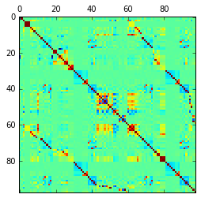


```python

%matplotlib inline
from matplotlib import pyplot as plt
import seaborn as sb
sb.set()

# ... scatter plots

df1.columns = df1.columns.str.strip()
col_names = df1.columns.values.tolist()

n_cols = len(df1.columns)

fig=plt.figure(figsize=(18, 16), dpi= 80, facecolor='w', edgecolor='k')

for i_col in range(n_cols-1):
    indx = i_col + 1
    plt.plot(df1.publish_date, df1.iloc[:, indx], label = col_names[indx], linestyle = 'None', marker = 'o')
    plt.xlabel('publish_date')
    plt.ylabel(col_names[indx])
    plt.title('mashable characteristics')
    plt.legend()
    plt.show()

#sb.tsplot(x = 'publish_date', y = 'kw_max_avg', data = df1,
#          fit_reg = False)


```

    /usr/lib/python3/dist-packages/matplotlib/__init__.py:874: UserWarning: axes.color_cycle is deprecated and replaced with axes.prop_cycle; please use the latter.
      warnings.warn(self.msg_depr % (key, alt_key))


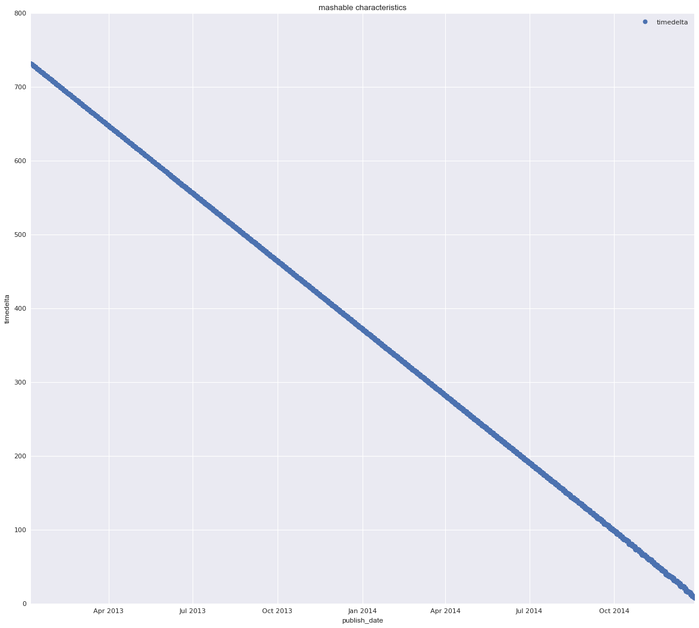


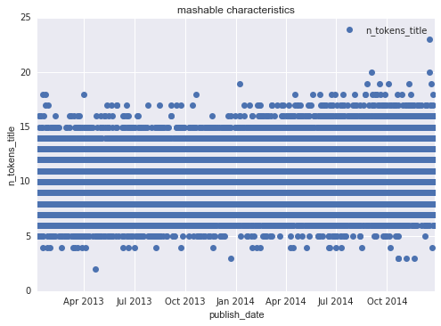


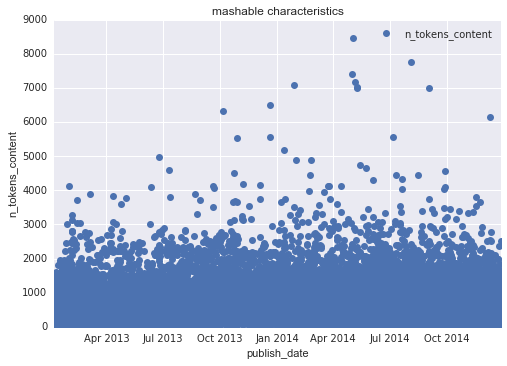


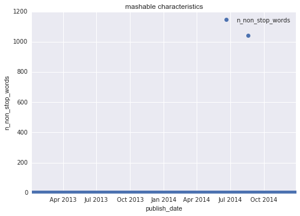


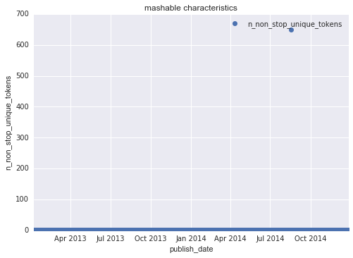


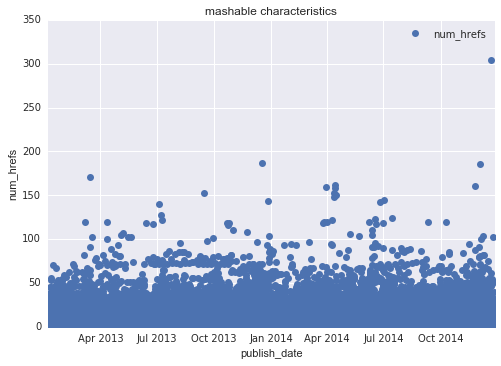


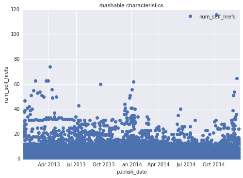


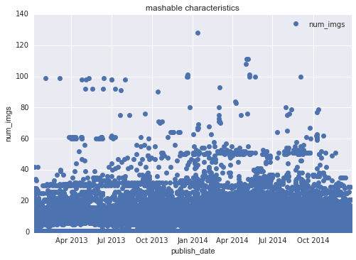


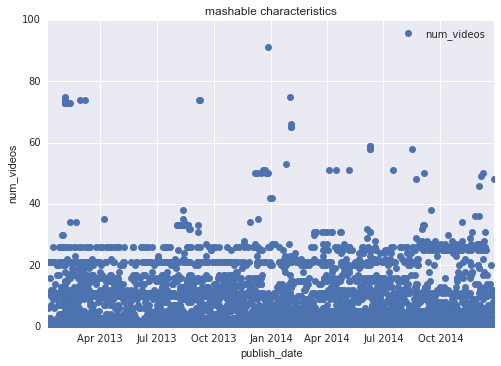


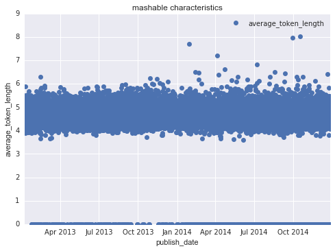


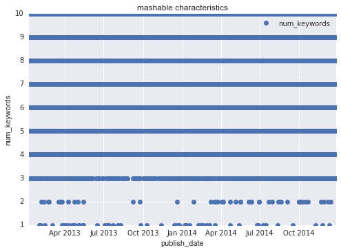


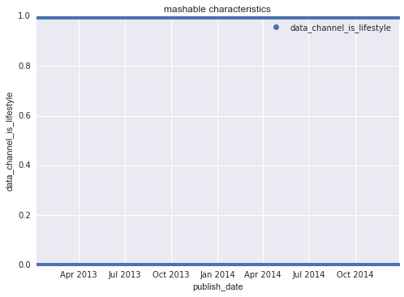


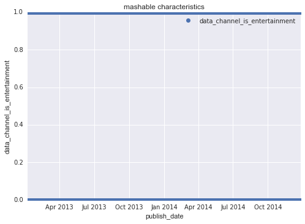


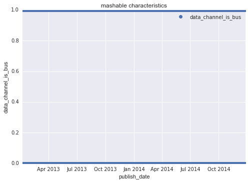


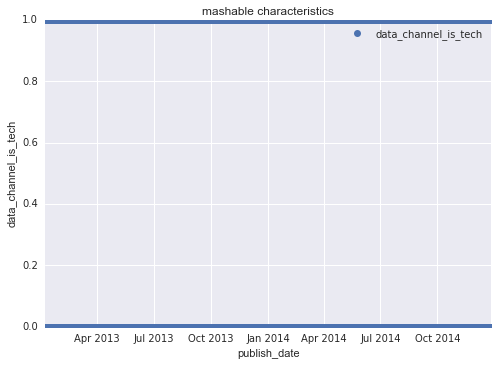


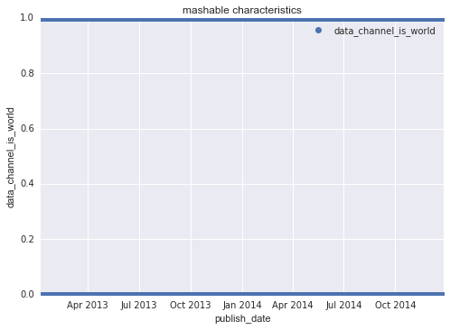


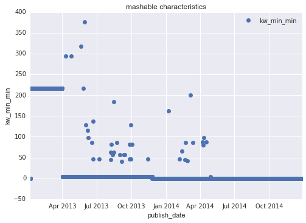


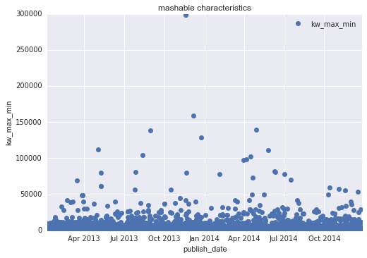


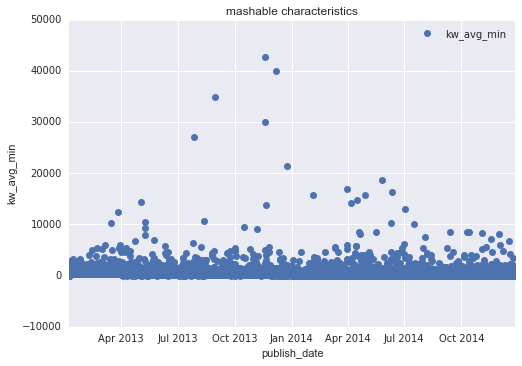


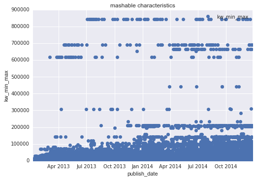


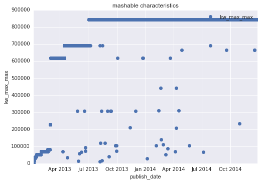


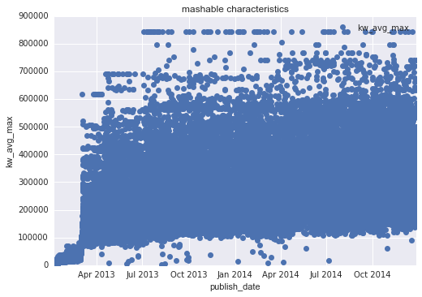


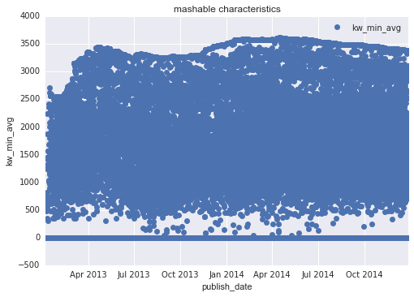


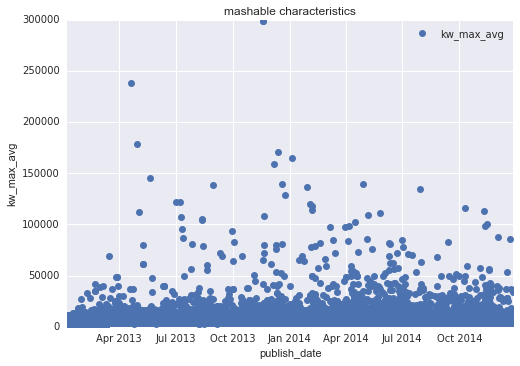


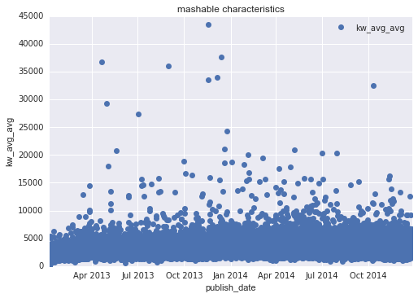


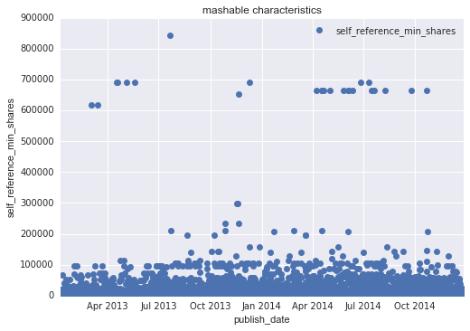


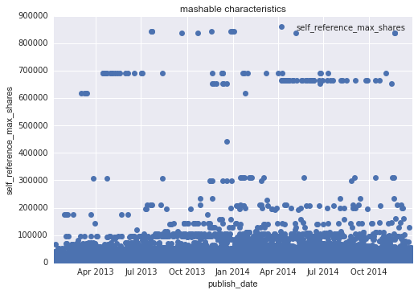


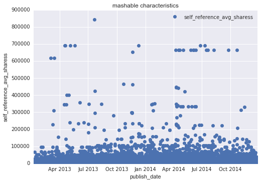


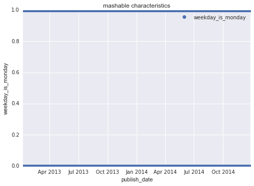


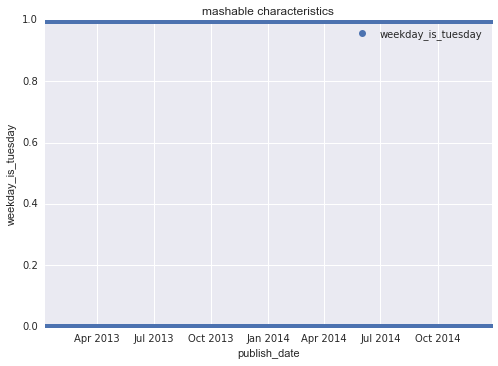


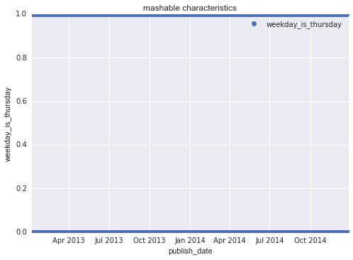


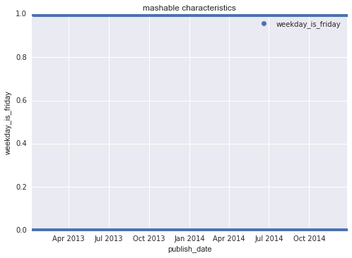


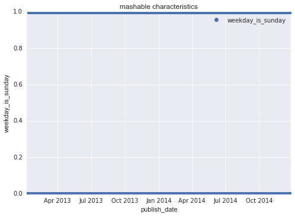


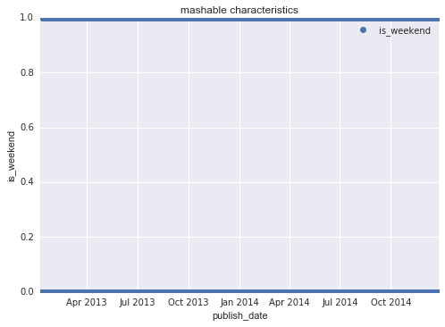


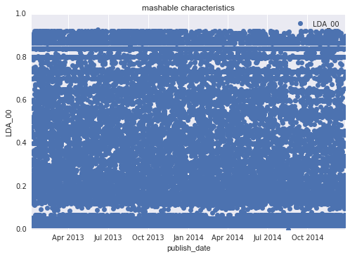


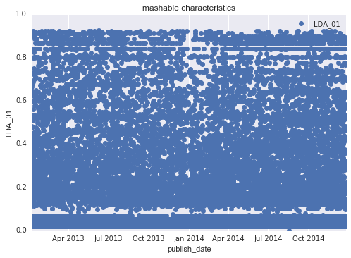


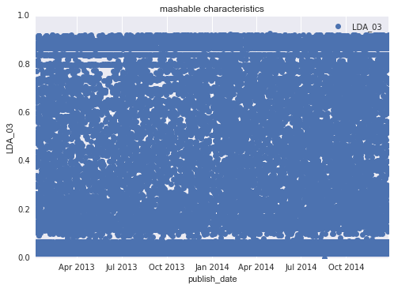


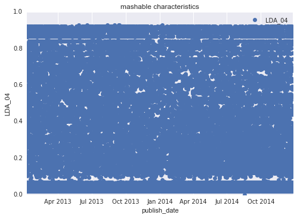


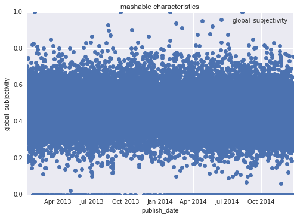


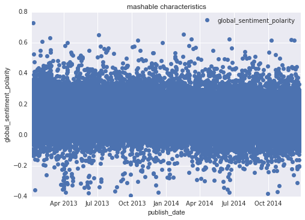


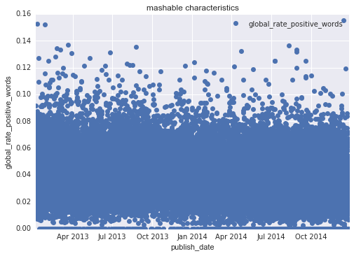


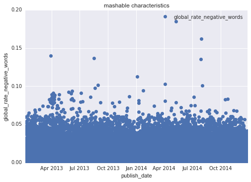


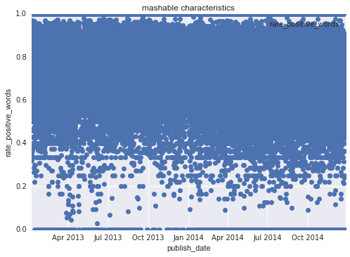


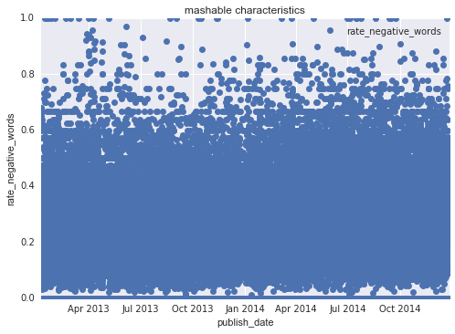


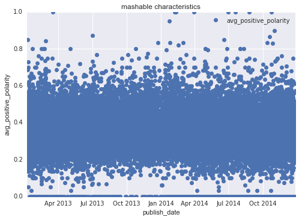


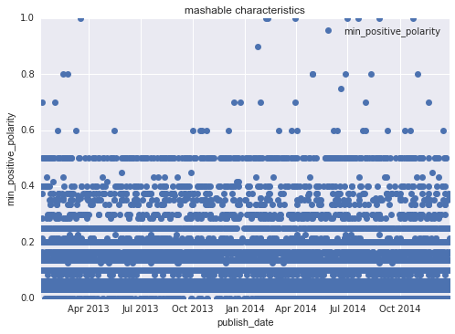


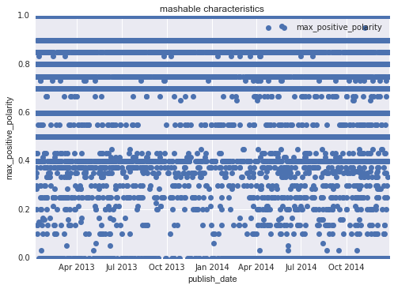


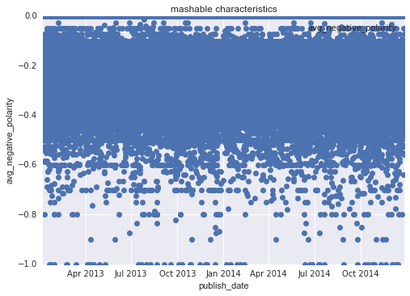


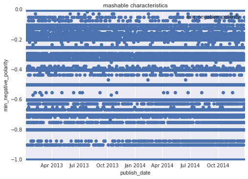


    ---------------------------------------------------------------------------

    AttributeError                            Traceback (most recent call last)

    <ipython-input-68-a94fe60c3334> in <module>()
         16 for i_col in range(n_cols-1):
         17     indx = i_col + 1
    ---> 18     plt.plot(df1.publish_date, df1.iloc[:, indx], label = col_names[indx], linestyle = 'None', marker = 'o')
         19     plt.xlabel('publish_date')
         20     plt.ylabel(col_names[indx])


    /usr/lib/python3/dist-packages/matplotlib/pyplot.py in plot(*args, **kwargs)
       3152         ax.hold(hold)
       3153     try:
    -> 3154         ret = ax.plot(*args, **kwargs)
       3155     finally:
       3156         ax.hold(washold)


    /usr/lib/python3/dist-packages/matplotlib/__init__.py in inner(ax, *args, **kwargs)
       1812                     warnings.warn(msg % (label_namer, func.__name__),
       1813                                   RuntimeWarning, stacklevel=2)
    -> 1814             return func(ax, *args, **kwargs)
       1815         pre_doc = inner.__doc__
       1816         if pre_doc is None:


    /usr/lib/python3/dist-packages/matplotlib/axes/_axes.py in plot(self, *args, **kwargs)
       1422             kwargs['color'] = c
       1423 
    -> 1424         for line in self._get_lines(*args, **kwargs):
       1425             self.add_line(line)
       1426             lines.append(line)


    /usr/lib/python3/dist-packages/matplotlib/axes/_base.py in _grab_next_args(self, *args, **kwargs)
        384                 return
        385             if len(remaining) <= 3:
    --> 386                 for seg in self._plot_args(remaining, kwargs):
        387                     yield seg
        388                 return


    /usr/lib/python3/dist-packages/matplotlib/axes/_base.py in _plot_args(self, tup, kwargs)
        334         ret = []
        335         if len(tup) > 1 and is_string_like(tup[-1]):
    --> 336             linestyle, marker, color = _process_plot_format(tup[-1])
        337             tup = tup[:-1]
        338         elif len(tup) == 3:


    /usr/lib/python3/dist-packages/matplotlib/axes/_base.py in _process_plot_format(fmt)
         84     # handle the multi char special cases and strip them from the
         85     # string
    ---> 86     if fmt.find('--') >= 0:
         87         linestyle = '--'
         88         fmt = fmt.replace('--', '')


    /usr/lib/python3/dist-packages/pandas/core/generic.py in __getattr__(self, name)
       2358                 return self[name]
       2359             raise AttributeError("'%s' object has no attribute '%s'" %
    -> 2360                                  (type(self).__name__, name))
       2361 
       2362     def __setattr__(self, name, value):


    AttributeError: 'Series' object has no attribute 'find'


```python
# ... bar plots

plt.bar(x, y, label = 'bars', color = 'slateblue')
plt.xlabel('x')
plt.ylabel('y')
plt.title('title')
plt.legend()
plt.show()

# ...  histograms

plt.hist(x, bins, histtype ='bar', rwidth = 0.8)
plt.xlabel('x')
plt.ylabel('y')
plt.title('title')
plt.legend()
plt.show()


sb.stripplot(x = 'day_of_week',
             y = 'log_shares',
             data = df1,
             jitter = True,
             hue = 'data_channel')
```


```python

```


<div>
<table border="1" class="dataframe">
  <thead>
    <tr style="text-align: right;">
      <th></th>
      <th>shares</th>
      <th>day_of_week</th>
      <th>data_channel</th>
      <th>log_shares</th>
      <th>year</th>
      <th>month</th>
      <th>day</th>
      <th>title</th>
    </tr>
  </thead>
  <tbody>
    <tr>
      <th>0</th>
      <td>593</td>
      <td>Mon</td>
      <td>Entertainment</td>
      <td>6.386879</td>
      <td>2013</td>
      <td>01</td>
      <td>07</td>
      <td>amazon-instant-video-browser</td>
    </tr>
    <tr>
      <th>1</th>
      <td>711</td>
      <td>Mon</td>
      <td>Business</td>
      <td>6.568078</td>
      <td>2013</td>
      <td>01</td>
      <td>07</td>
      <td>ap-samsung-sponsored-tweets</td>
    </tr>
    <tr>
      <th>2</th>
      <td>1500</td>
      <td>Mon</td>
      <td>Business</td>
      <td>7.313887</td>
      <td>2013</td>
      <td>01</td>
      <td>07</td>
      <td>apple-40-billion-app-downloads</td>
    </tr>
    <tr>
      <th>3</th>
      <td>1200</td>
      <td>Mon</td>
      <td>Entertainment</td>
      <td>7.090910</td>
      <td>2013</td>
      <td>01</td>
      <td>07</td>
      <td>astronaut-notre-dame-bcs</td>
    </tr>
    <tr>
      <th>4</th>
      <td>505</td>
      <td>Mon</td>
      <td>Tech</td>
      <td>6.226537</td>
      <td>2013</td>
      <td>01</td>
      <td>07</td>
      <td>att-u-verse-apps</td>
    </tr>
    <tr>
      <th>5</th>
      <td>855</td>
      <td>Mon</td>
      <td>Tech</td>
      <td>6.752270</td>
      <td>2013</td>
      <td>01</td>
      <td>07</td>
      <td>beewi-smart-toys</td>
    </tr>
    <tr>
      <th>6</th>
      <td>556</td>
      <td>Mon</td>
      <td>Lifestyle</td>
      <td>6.322565</td>
      <td>2013</td>
      <td>01</td>
      <td>07</td>
      <td>bodymedia-armbandgets-update</td>
    </tr>
    <tr>
      <th>7</th>
      <td>891</td>
      <td>Mon</td>
      <td>Tech</td>
      <td>6.793466</td>
      <td>2013</td>
      <td>01</td>
      <td>07</td>
      <td>canon-poweshot-n</td>
    </tr>
    <tr>
      <th>8</th>
      <td>3600</td>
      <td>Mon</td>
      <td>Tech</td>
      <td>8.188967</td>
      <td>2013</td>
      <td>01</td>
      <td>07</td>
      <td>car-of-the-future-infographic</td>
    </tr>
    <tr>
      <th>9</th>
      <td>710</td>
      <td>Mon</td>
      <td>World</td>
      <td>6.566672</td>
      <td>2013</td>
      <td>01</td>
      <td>07</td>
      <td>chuck-hagel-website</td>
    </tr>
    <tr>
      <th>10</th>
      <td>2200</td>
      <td>Mon</td>
      <td>World</td>
      <td>7.696667</td>
      <td>2013</td>
      <td>01</td>
      <td>07</td>
      <td>cosmic-events-doomsday</td>
    </tr>
    <tr>
      <th>11</th>
      <td>1900</td>
      <td>Mon</td>
      <td>Lifestyle</td>
      <td>7.550135</td>
      <td>2013</td>
      <td>01</td>
      <td>07</td>
      <td>crayon-creatures</td>
    </tr>
    <tr>
      <th>12</th>
      <td>823</td>
      <td>Mon</td>
      <td>Lifestyle</td>
      <td>6.714171</td>
      <td>2013</td>
      <td>01</td>
      <td>07</td>
      <td>creature-cups</td>
    </tr>
    <tr>
      <th>13</th>
      <td>10000</td>
      <td>Mon</td>
      <td>Lifestyle</td>
      <td>9.210440</td>
      <td>2013</td>
      <td>01</td>
      <td>07</td>
      <td>dad-jokes</td>
    </tr>
    <tr>
      <th>14</th>
      <td>761</td>
      <td>Mon</td>
      <td>Lifestyle</td>
      <td>6.635947</td>
      <td>2013</td>
      <td>01</td>
      <td>07</td>
      <td>downton-abbey-tumblrs</td>
    </tr>
    <tr>
      <th>15</th>
      <td>1600</td>
      <td>Mon</td>
      <td>World</td>
      <td>7.378384</td>
      <td>2013</td>
      <td>01</td>
      <td>07</td>
      <td>earth-size-planets-milky-way</td>
    </tr>
    <tr>
      <th>16</th>
      <td>13600</td>
      <td>Mon</td>
      <td>Lifestyle</td>
      <td>9.517899</td>
      <td>2013</td>
      <td>01</td>
      <td>07</td>
      <td>echo-game</td>
    </tr>
    <tr>
      <th>17</th>
      <td>3100</td>
      <td>Mon</td>
      <td>Business</td>
      <td>8.039480</td>
      <td>2013</td>
      <td>01</td>
      <td>07</td>
      <td>entrepreneur-trends-2013</td>
    </tr>
    <tr>
      <th>18</th>
      <td>5700</td>
      <td>Mon</td>
      <td>Lifestyle</td>
      <td>8.648397</td>
      <td>2013</td>
      <td>01</td>
      <td>07</td>
      <td>facebook-sick-app</td>
    </tr>
    <tr>
      <th>19</th>
      <td>17100</td>
      <td>Mon</td>
      <td>Tech</td>
      <td>9.746892</td>
      <td>2013</td>
      <td>01</td>
      <td>07</td>
      <td>felt-audio-pulse-speaker</td>
    </tr>
  </tbody>
</table>
</div>


```python
sb.stripplot(x = 'data_channel',
             y = 'ln_shares',
             data = df1,
             jitter = True)

sb.stripplot(x = 'day_of_week',
             y = 'ln_shares',
             data = df1,
             jitter = True)

# horizontal boxes
#plt.boxplot(df1['day_of_week'])

```

    /usr/lib/python3/dist-packages/matplotlib/__init__.py:894: UserWarning: axes.color_cycle is deprecated and replaced with axes.prop_cycle; please use the latter.
      warnings.warn(self.msg_depr % (key, alt_key))


    <matplotlib.axes._subplots.AxesSubplot at 0x7f9574b22f28>


```python
list(df1)
```


    ['url',
     'timedelta',
     'n_tokens_title',
     'n_tokens_content',
     'n_unique_tokens',
     'n_non_stop_words',
     'n_non_stop_unique_tokens',
     'num_hrefs',
     'num_self_hrefs',
     'num_imgs',
     'num_videos',
     'average_token_length',
     'num_keywords',
     'data_channel_is_lifestyle',
     'data_channel_is_entertainment',
     'data_channel_is_bus',
     'data_channel_is_socmed',
     'data_channel_is_tech',
     'data_channel_is_world',
     'kw_min_min',
     'kw_max_min',
     'kw_avg_min',
     'kw_min_max',
     'kw_max_max',
     'kw_avg_max',
     'kw_min_avg',
     'kw_max_avg',
     'kw_avg_avg',
     'self_reference_min_shares',
     'self_reference_max_shares',
     'self_reference_avg_sharess',
     'weekday_is_monday',
     'weekday_is_tuesday',
     'weekday_is_wednesday',
     'weekday_is_thursday',
     'weekday_is_friday',
     'weekday_is_saturday',
     'weekday_is_sunday',
     'is_weekend',
     'LDA_00',
     'LDA_01',
     'LDA_02',
     'LDA_03',
     'LDA_04',
     'global_subjectivity',
     'global_sentiment_polarity',
     'global_rate_positive_words',
     'global_rate_negative_words',
     'rate_positive_words',
     'rate_negative_words',
     'avg_positive_polarity',
     'min_positive_polarity',
     'max_positive_polarity',
     'avg_negative_polarity',
     'min_negative_polarity',
     'max_negative_polarity',
     'title_subjectivity',
     'title_sentiment_polarity',
     'abs_title_subjectivity',
     'abs_title_sentiment_polarity',
     'shares',
     'day_of_week',
     'data_channel',
     'log_shares']


```python
df1.ix[:,0].head(200)
```


    0      http://mashable.com/2013/01/07/amazon-instant-...
    1      http://mashable.com/2013/01/07/ap-samsung-spon...
    2      http://mashable.com/2013/01/07/apple-40-billio...
    3      http://mashable.com/2013/01/07/astronaut-notre...
    4       http://mashable.com/2013/01/07/att-u-verse-apps/
    5       http://mashable.com/2013/01/07/beewi-smart-toys/
    6      http://mashable.com/2013/01/07/bodymedia-armba...
    7       http://mashable.com/2013/01/07/canon-poweshot-n/
    8      http://mashable.com/2013/01/07/car-of-the-futu...
    9      http://mashable.com/2013/01/07/chuck-hagel-web...
    10     http://mashable.com/2013/01/07/cosmic-events-d...
    11      http://mashable.com/2013/01/07/crayon-creatures/
    12         http://mashable.com/2013/01/07/creature-cups/
    13             http://mashable.com/2013/01/07/dad-jokes/
    14     http://mashable.com/2013/01/07/downton-abbey-t...
    15     http://mashable.com/2013/01/07/earth-size-plan...
    16             http://mashable.com/2013/01/07/echo-game/
    17     http://mashable.com/2013/01/07/entrepreneur-tr...
    18     http://mashable.com/2013/01/07/facebook-sick-app/
    19     http://mashable.com/2013/01/07/felt-audio-puls...
    20          http://mashable.com/2013/01/07/ford-glympse/
    21      http://mashable.com/2013/01/07/ftc-google-leaks/
    22     http://mashable.com/2013/01/07/fujifilm-50x-su...
    23     http://mashable.com/2013/01/07/hillary-clinton...
    24                http://mashable.com/2013/01/07/htc-q1/
    25     http://mashable.com/2013/01/07/huawei-ascend-m...
    26     http://mashable.com/2013/01/07/iheartradio-app...
    27     http://mashable.com/2013/01/07/intel-awesome-l...
    28     http://mashable.com/2013/01/07/isp02-iphone-ta...
    29        http://mashable.com/2013/01/07/jobs-contently/
                                 ...                        
    170           http://mashable.com/2013/01/09/tethercell/
    171    http://mashable.com/2013/01/09/toyotas-self-dr...
    172    http://mashable.com/2013/01/09/verizon-q4-smar...
    173    http://mashable.com/2013/01/09/walking-dead-po...
    174    http://mashable.com/2013/01/09/warner-bros-twe...
    175    http://mashable.com/2013/01/09/why-eric-schmid...
    176    http://mashable.com/2013/01/09/will-ferrell-fi...
    177    http://mashable.com/2013/01/09/withings-smart-...
    178    http://mashable.com/2013/01/09/would-you-wear-...
    179    http://mashable.com/2013/01/09/zendesk-valley-...
    180    http://mashable.com/2013/01/10/2013-oscar-pred...
    181    http://mashable.com/2013/01/10/al-roker-pooped...
    182       http://mashable.com/2013/01/10/amazon-autorip/
    183    http://mashable.com/2013/01/10/amazon-free-mov...
    184    http://mashable.com/2013/01/10/apocalyptathon-...
    185    http://mashable.com/2013/01/10/apple-ios-app-s...
    186    http://mashable.com/2013/01/10/axe-buzz-aldrin...
    187    http://mashable.com/2013/01/10/baby-clothing-i...
    188         http://mashable.com/2013/01/10/banshee-gifs/
    189           http://mashable.com/2013/01/10/bookacoach/
    190      http://mashable.com/2013/01/10/cats-in-pajamas/
    191    http://mashable.com/2013/01/10/cellphone-carri...
    192      http://mashable.com/2013/01/10/ces-booth-babes/
    193    http://mashable.com/2013/01/10/ces-challenge-n...
    194    http://mashable.com/2013/01/10/cheaper-iphone-...
    195    http://mashable.com/2013/01/10/chilly-gonzales...
    196            http://mashable.com/2013/01/10/commbadge/
    197    http://mashable.com/2013/01/10/computing-deskt...
    198    http://mashable.com/2013/01/10/creepy-robotic-...
    199    http://mashable.com/2013/01/10/danny-devito-ce...
    Name: url, dtype: object


#### parse url into individual text fields
